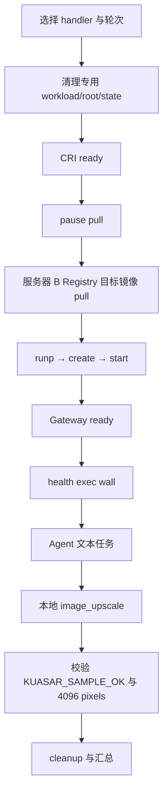

# OpenClaw + Kuasar + Cloud Hypervisor 实验平台

本项目搭建了一套独立于主机现有 containerd/Kata 配置的实验平台，使用
containerd CRI v1 作为上层交互入口，在同一个隔离 containerd 上比较三条
OpenClaw 路径：

```text
OpenClaw
  → CRI v1
  → 隔离 containerd
  → runc / Kuasar runc / Kuasar VMM
  → Cloud Hypervisor（VMM 路径）
```

专用 CRI endpoint：

```text
unix:///run/openclaw-kuasar/containerd.sock
```

完整实验报告见：[docs/2026-07-21-runtime-breakdown.md](docs/2026-07-21-runtime-breakdown.md)。
故障处理与上下文恢复见：[HANDOFF.md](HANDOFF.md)。

## 当前状态（2026-08-07）

部署 gate 和最终实验(每条Openclaw路径3轮实验)均已完成：

| 项目 | 状态 |
| --- | --- |
| 主机 OpenClaw Gateway | PASS |
| 普通 runc + OpenClaw | PASS |
| Kuasar runc + OpenClaw | PASS |
| Kuasar VMM + Cloud Hypervisor + OpenClaw | PASS |
| Gateway health | PASS |
| 缓存镜像基线 | PASS |
| 服务器 B Registry 冷拉取 | PASS |
| 本地图片超分 workload | PASS |

控制 Agent 样例均精确返回 `KUASAR_SAMPLE_OK`，provider/model 为
`deepseek/deepseek-v4-flash`，未使用 fallback。图片 workload 通过文本指令调用
容器内本地 `image_upscale` 工具，不依赖 DeepSeek 多模态输入。

## 最终实验结论

### 缓存镜像 OpenClaw 基线

主结果：`.artifacts/breakdown-20260720T080115Z`，每种 handler 三轮。

| 指标（3 轮平均） | runc | Kuasar runc | Kuasar VMM |
| --- | ---: | ---: | ---: |
| Gateway ready | 4.213 s | 4.201 s | 40.102 s |
| health exec wall | 3.396 s | 3.421 s | 32.900 s |
| Agent sample exec wall | 6.073 s | 6.435 s | 47.936 s |
| 整轮 total | 14.249 s | 14.659 s | 122.057 s |

Kuasar runc 与普通 runc 接近。VMM 的 `runp/create/start` 只有百毫秒级增量，
主要差异位于 Guest 内 OpenClaw bootstrap、Gateway 初始化、health CLI 和
virtiofs 文件访问。

### 远端 Registry 镜像冷拉取

主结果：`.artifacts/remote-coldstart-20260721T040235Z`，每轮清空专用
containerd root/state 后从服务器 B `10.2.30.50:5000` 拉取，三种 handler 各三轮。

| 指标（3 轮平均） | runc | Kuasar runc | Kuasar VMM |
| --- | ---: | ---: | ---: |
| pause pull | 6.147 s | 6.152 s | 6.386 s |
| 目标 OpenClaw pull | 8.050 s | 8.020 s | 8.046 s |
| Gateway ready | 4.210 s | 4.206 s | 40.151 s |
| Agent sample exec wall | 5.885 s | 5.911 s | 47.357 s |
| 整轮 total | 29.375 s | 29.147 s | 135.153 s |

目标镜像 pull 在三种 handler 上都约 8 秒，主要由 Registry、内网传输和解压决定，
不能据此判断 runtime handler 的性能。`pause pull` 是 Pod sandbox 的公共基础成本，
单独记录，不并入目标镜像 `pull_ms`，但会计入包含它的整轮 `total`。

### 复杂本地图片 workload

主结果：`.artifacts/image-workload-20260721T071440Z`，每种 handler 三轮。
输入为 32x32 PGM（1,024 pixels），工具按 `scale=2` 输出 64x64 PGM
（4,096 pixels），并执行确定性平滑。

| 指标（3 轮平均） | runc | Kuasar runc | Kuasar VMM |
| --- | ---: | ---: | ---: |
| Agent sample exec wall | 8.123 s | 8.068 s | 54.537 s |
| Agent internal | 4.231 s | 4.272 s | 14.442 s |
| `image_upscale` tool total | 87.543 ms | 86.723 ms | 91.388 ms |
| 输出像素数 | 4,096 | 4,096 | 4,096 |
| 整轮 total | 16.327 s | 16.291 s | 125.394 s |

图片工具本身只耗时约 87--91 ms，VMM 约为 runc 的 1.04 倍，因此图片计算不是
VMM 慢的来源。后续 `/app` 文件系统严格 A/B 已确认：将 `/app` 从 VirtioFS 换成
virtio-blk 后，Gateway、health 和 Agent 初始化均明显下降，而 `start` 只增加数毫秒。

## `/app` 混合挂载严格 A/B 结果

两组均使用 VirtioFS rootfs、virtio-blk state、virtio-blk `/usr/local`、同一远端镜像和
相同的 512-pass image-upscale workload；唯一变量是 `/app` 的 backing。每组 3 轮，
均为 3/3 PASS，Agent sample 无 fallback。

| 指标（3 轮平均） | `/app` VirtioFS | `/app` virtio-blk |
| --- | ---: | ---: |
| `start` | 63 ms | 70 ms |
| Gateway ready | 7.903 s | **6.553 s** |
| health exec wall | 8.071 s | **7.027 s** |
| Agent sample exec wall | 11.535 s | **9.507 s** |
| Agent internal | 4.484 s | **3.723 s** |
| `image_upscale` tool total | 115.2 ms | 114.2 ms |
| 整轮 total | 28.743 s | **24.370 s** |

这说明 `/app` 小文件访问是混合方案剩余延迟的主要来源之一；将 `/app` 放到
virtio-blk 可以保留 VirtioFS 的低 VMM 启动成本，同时显著改善 Gateway、health 和
Agent 初始化。

## 固定版本与配置

- OpenClaw：2026.6.11
- Kuasar：v1.1.0
- Cloud Hypervisor：v52.0
- OpenClaw 镜像：`localhost/openclaw-kuasar:2026.6.11-virtiofs`
- Pause 镜像：`registry.k8s.io/pause:3.10`
- VMM：2 vCPU、2048 MiB、Cloud Hypervisor、virtiofs
- CNI IPv4 网段：10.86.0.0/16
- 专用 containerd socket：`/run/openclaw-kuasar/containerd.sock`
- 远端 Registry：`10.2.30.50:5000`

下载地址、SHA256 校验值和默认 runtime 配置位于 [config/versions.env](config/versions.env)。

## 从零部署

先执行只读预检和静态测试：

```bash
./scripts/00-check-host.sh
bash tests/test-runtime-config.sh
bash tests/test-cri-specs.sh
bash tests/test-platform-cli.sh
bash tests/test-openclaw-virtiofs-image.sh
```

下载并安装隔离 runtime：

```bash
./scripts/05-fetch-runtime.sh
sudo ./scripts/06-install-runtime.sh
```

准备 OpenClaw 状态、构建/导入镜像并生成 CRI spec：

```bash
./scripts/07-prepare-openclaw-state.sh

RUN_CRICTL=1 \
  ./scripts/02-build-openclaw-image.sh

OPENCLAW_DATA_DIR="$HOME/.local/share/openclaw-kuasar/openclaw-state" \
  ./scripts/03-generate-cri-specs.sh
```

确认三个隔离服务 active：

```bash
sudo systemctl is-active \
  openclaw-kuasar-runc.service \
  openclaw-kuasar-vmm.service \
  openclaw-kuasar-containerd.service
```

## 运行单个 runtime

```bash
OPENCLAW_RUNTIME_HANDLER=runc \
  AUTO_CLEANUP=0 \
  RUN_CRICTL=1 \
  ./scripts/04-run-with-crictl.sh

OPENCLAW_RUNTIME_HANDLER=kuasar-runc \
  AUTO_CLEANUP=0 \
  RUN_CRICTL=1 \
  ./scripts/04-run-with-crictl.sh

OPENCLAW_RUNTIME_HANDLER=kuasar-vmm \
  AUTO_CLEANUP=0 \
  RUN_CRICTL=1 \
  ./scripts/04-run-with-crictl.sh
```

健康检查：

```bash
EP=unix:///run/openclaw-kuasar/containerd.sock
CID=$(jq -r '.container_id // empty' state/last-run.json)

sudo crictl \
  --runtime-endpoint "$EP" \
  --image-endpoint "$EP" \
  exec "$CID" node openclaw.mjs gateway health --json
```

## 运行最终实验

### 1. 通用 runtime 冷启动

该组使用缓存镜像和简单 shell 入口，只隔离 runtime/container init，不启动
OpenClaw Gateway。结果目录由脚本输出，最终参考结果为
`.artifacts/container-coldstart-20260720T025853Z`。

```bash
./scripts/14-benchmark-cursor-container.sh
```

### 2. 缓存镜像 OpenClaw 基线

`MODEL_SAMPLE_RUNS=3` 必须显式开启 Agent 控制样例；旧版本默认值为 0，表示未执行
Agent 阶段，不代表 0 ms。

```bash
BENCHMARK_HANDLERS="runc kuasar-runc kuasar-vmm" \
  BENCHMARK_RUNS=3 \
  MODEL_SAMPLE_RUNS=3 \
  ./scripts/08-benchmark-runtimes.sh
```

结果写入 `.artifacts/breakdown-*/results.json` 和 `summary.json`。

### 3. 服务器 B Registry 远端冷拉取

该脚本会清空专用 containerd root/state，必须确认没有遗留 workload，并显式传入
`--confirm-cold-reset`。它只操作 `/var/lib/openclaw-kuasar` 和对应 state，不删除
主机默认 containerd 的镜像。

```bash
REMOTE_IMAGE=10.2.30.50:5000/openclaw-kuasar:2026.6.11-virtiofs \
  HANDLERS="runc kuasar-runc kuasar-vmm" \
  RUNS=3 \
  ./scripts/15-benchmark-remote-coldstart.sh \
  --confirm-cold-reset
```

每轮会分别记录 `pause_pull_ms`、目标 `pull_ms`、runtime、Gateway、health、Agent
和 cleanup。`pull_ms` 只覆盖目标 OpenClaw 镜像 pull。

### 4. 本地图片超分 workload

该脚本使用缓存镜像，通过文本 Agent 指令调用容器内 `image_upscale` 工具；图片不
发送给模型。

```bash
IMAGE_WORKLOAD_HANDLERS="runc kuasar-runc kuasar-vmm" \
  IMAGE_WORKLOAD_RUNS=3 \
  ./scripts/17-benchmark-image-workload.sh
```

结果写入 `.artifacts/image-workload-*/results.json` 和 `summary.json`，验收条件为
工具 trace 正确、输入 1,024 pixels、输出 4,096 pixels、Agent 返回
`KUASAR_SAMPLE_OK`。

## 最终实验流程



缓存基线从 `CRI ready` 开始且不重复 pull；远端冷拉取在 runtime 生命周期前增加
`reset → pause pull → target pull`；图片 workload 在 Agent 阶段增加本地工具调用。
当前远端 pull 和图片 workload 是两个互补批次，不能直接相加两个批次的 `total`。

## 已解决的关键兼容问题

- Registry reset/EOF：通过主机 HTTP 代理完成初始镜像拉取；服务器 B Registry 用于
  远端冷拉取。
- runc sandboxer systemd 超时：服务类型改为 `simple`。
- host UTS/PID/IPC namespace 错误：使用正确的 Pod namespace 配置。
- 主机与容器 Gateway 端口冲突：容器 Gateway 使用独立端口 18790/18791。
- Kuasar virtio-blk Guest mount EIO：切换为 virtiofs。
- youki cpuset controller 错误：移除会触发旧 OCI 兼容问题的 CRI resources。
- Node SQLite WAL 在 virtiofs 上返回 `SQLITE_IOERR_SHMMAP`：VMM 状态路径使用
  rollback journal 配置。
- VMM 状态目录 UID/权限问题：为 VMM 使用专用状态目录和匹配的 spec 权限。
- DeepSeek plugin/auth：在 VMM 状态目录中注册插件、复制可迁移 auth profile 并
  规范化 SQLite journal。
- VMM 无网络：启用独立 IPv4 CNI、DNS、NAT 和 firewall forwarding。

## 数据、凭据与 Git 边界

以下路径不会进入 Git：

- `.cache/`：运行时二进制、内核和 VM 镜像；
- `.state/`：临时 runtime ID；
- `.artifacts/`：原始 benchmark JSON 和日志；
- `.secrets/`：本地秘密；
- `images/openclaw/*.tar`：导出的镜像；
- `HANDOFF.md`：上下文恢复记录（按当前 `.gitignore` 约定）。

主机凭据只存在于仓库外的 OpenClaw 状态目录，不应复制到文档、镜像层或 Git 历史
中。运行时下载地址和校验值可以提交，API key、auth SQLite、代理凭据和日志不能提交。

## 回滚

回滚只停止本实验服务，不删除主机现有 containerd/Kata：

```bash
sudo systemctl disable --now \
  openclaw-kuasar-containerd.service \
  openclaw-kuasar-vmm.service \
  openclaw-kuasar-runc.service

sudo systemctl daemon-reload
```
