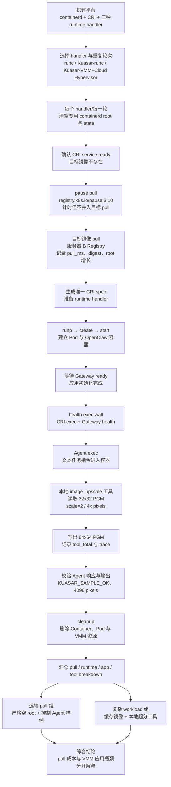

# OpenClaw / Kuasar runtime breakdown

测试日期：2026-07-17（缓存镜像对照）；远端冷拉取与复杂 workload 批量测试：2026-07-21

## 测试目标

比较同一套隔离 containerd CRI 上的三条 OpenClaw 路径：

1. 普通 runc
2. Kuasar runc sandboxer
3. Kuasar VMM sandboxer + Cloud Hypervisor

基础对照实验使用已缓存镜像，镜像下载时间不计入该组测试；远端 Registry 冷拉取结果另列一节。控制样例要求只返回 KUASAR_SAMPLE_OK。新增的复杂 workload 使用文本 Agent 指令调用容器内的本地 `image_upscale` 工具，不依赖 DeepSeek 多模态输入；两类样例都使用 DeepSeek deepseek-v4-flash，通过 `--local` 执行 embedded agent，避免 Gateway pairing 对测量的干扰。

## 通用容器冷启动扩展

本节测量的是通用容器的 runtime 冷启动，不依赖特定应用。测试使用已导入隔离 containerd 的统一 OpenClaw 镜像作为 workload，并让容器在 shell 进程启动后立即输出就绪标记；因此该结果专门隔离 runtime 启动成本，不把 OpenClaw Gateway 初始化混入其中。

冷启动分为三个口径：

- **缓存镜像 runtime 冷启动**：镜像已经存在于隔离 containerd，计时
  `runp → create → start → 容器进程就绪 → cleanup`。本轮已完成。
- **应用冷启动**：从容器启动到 OpenClaw Gateway ready；已有基础 breakdown 和
  Gateway 阶段细分结果。
- **镜像拉取冷启动**：首次从远端 registry 拉取镜像，再执行 runtime 启动；镜像
  拉取时间应单独记录，不能与 runtime handler 的启动时间混为一谈。本项已完成，结果见下文“远端 Registry 镜像拉取冷启动”中的独立批量实验。

本轮结果目录为
`.artifacts/container-coldstart-20260720T025853Z`，镜像拉取时间为 `pull_ms=0`，
9 次运行全部 PASS：

| 阶段 | runc | kuasar-runc | kuasar-vmm |
| --- | ---: | ---: | ---: |
| runp | 73 ms | 23 ms | 297 ms |
| create | 27 ms | 26 ms | 35 ms |
| start API | 69 ms | 62 ms | 71 ms |
| 容器就绪标记 | 24 ms | 23 ms | 25 ms |
| cleanup | 137 ms | 205 ms | 320 ms |
| **runtime 冷启动总时间** | **330 ms** | **340 ms** | **747 ms** |

在本 workload 下，Kuasar runc 与普通 runc 的总时间相差约 3%；Kuasar VMM 约为 runc 的 2.26 倍。VMM 的主要增量来自 sandbox `runp` 和资源回收，而不是容器 init 进程的 `start` 或就绪标记阶段。

这组数据不能替代 Gateway ready：此前 Gateway ready 平均约为 runc/Kuasar runc 的 4.2 秒、Kuasar VMM 的 40.1 秒；后者还包含 Node/OpenClaw、插件、状态 目录和 virtiofs I/O。两者合并后，才能描述“容器 runtime 冷启动 + 应用冷启动” 的完整缓存镜像路径。

## 阶段定义与计时边界

benchmark 从宿主机调用 CRI 开始计时。除 health JSON durationMs 和 agent internal 外，其余指标都是宿主机观察到的 wall-clock time，包含进程调度、RPC 和 I/O 等待。各阶段按以下顺序串行执行：

    CRI ready -> runp -> create -> start -> Gateway ready
              -> exec true -> exec Node -> health exec
              -> agent sample（启用时）-> cleanup

| 指标 | 起点与终点 | 期间的具体行为 | 该指标主要揭示什么 |
| --- | --- | --- | --- |
| CRI ready | 开始执行 crictl info，到 containerd 返回 CRI info | 连接专用 Unix socket，调用 CRI RuntimeService，确认隔离 containerd 可服务 | containerd/CRI 控制面是否就绪；不含 Pod 或容器创建 |
| runp | 发出 CRI RunPodSandbox，到 CRI 返回 Pod sandbox ID | containerd 解析 Pod spec、选择 runtime handler、预留 sandbox 名称、准备 sandbox 网络和基础资源。runc 创建 pause sandbox；kuasar-runc 把请求交给 runc-sandboxer；kuasar-vmm 把请求交给 vmm-sandboxer，并按当前实现建立或启动 Cloud Hypervisor sandbox、guest 与 CNI 环境 | Pod sandbox 建立成本，以及 Kuasar/VMM 控制面的额外成本；不含 OpenClaw 容器进程启动 |
| create | 发出 CRI CreateContainer，到返回 container ID | 解析容器 spec、解析镜像与 snapshot、生成 OCI/guest 容器配置、登记容器元数据和挂载；此时 OpenClaw 尚未执行 | 容器元数据、rootfs、mount 和 OCI spec 准备成本 |
| start | 发出 CRI StartContainer，到 CRI 返回 | 创建并启动容器 init 进程。VMM 路径由 host runtime 将启动请求送入 guest task service；返回只表示启动请求成功，不表示 Gateway 已可用 | 从“已创建容器”到“容器主进程开始运行”的 runtime 成本 |
| Gateway ready | StartContainer 返回后开始，到容器日志首次出现 [gateway] ready | VMM 专用入口先检查状态目录、插件和写权限；随后 Node/OpenClaw 加载配置、解析认证、初始化插件和 SQLite 状态、创建 HTTP/WebSocket server、启动 channel/sidecar，最后输出 ready。benchmark 每秒读取一次唯一 CRI 日志文件 | 当前缓存与状态条件下，应用从新容器进程启动到真正可提供 Gateway 服务的时间；包含 OpenClaw 初始化和状态存储 I/O |
| exec true | 发出 CRI ExecSync true，到空命令退出 | containerd 建立 exec 请求；Kuasar 路径经过 sandboxer/shim，VMM 路径把请求发送到 guest；guest 仅运行 true | 尽量排除应用逻辑后，观察 CRI exec、shim、vsock/guest task 等通用执行通道开销 |
| exec Node | 发出 CRI ExecSync node -e，到 Node 输出 OK | 与 exec true 相同，但额外启动一次 Node.js 进程并初始化最小 JS runtime | 区分通用 exec 通道和 Node 进程启动成本 |
| health exec wall | 宿主机发出完整 health 命令，到命令返回 JSON | exec 通道启动 Node/OpenClaw CLI；CLI 加载配置、插件与状态，连接 127.0.0.1:18790 的 Gateway WebSocket，发送 health RPC，并序列化结果 | 用户从宿主机实际感受到的一次完整健康检查延迟 |
| health JSON durationMs | health JSON 中的 durationMs | 已启动的 health CLI 与 Gateway 建立请求后，health 命令返回 JSON 中记录的 durationMs；它覆盖的边界宽于 WS 日志中的单次 health handler | 用于和完整 wall time 对照，但不能直接等同于纯 Gateway WS handler 时间 |
| sample exec wall | 发出 OpenClaw agent 命令，到完整 JSON 返回 | 经 exec 启动 Node/OpenClaw，加载 agent、插件、auth 与 session 状态，向 DeepSeek 发起请求，处理响应并写回 session；复杂 workload 还包括模型选择本地工具、工具执行和结果回传 | 一次完整 agent 请求的宿主机端到端延迟 |
| agent internal | sample JSON 的 meta.durationMs | OpenClaw agent runtime 从任务开始到生成最终结果的内部计时，包含 provider 请求、Agent 推理和可选工具调用 | agent/模型路径内部耗时；不包含 sample exec wall 中全部外层 CLI 启动成本 |
| exec 外层差值 | sample exec wall 减 agent internal | 不是单独执行的命令，而是派生指标 | 近似表示 exec、Node/OpenClaw CLI 初始化、配置/插件/SQLite/session I/O 等 agent 内部计时之外的开销 |
| cleanup | 开始 stop/rm container，到 stopp/rmp sandbox 完成 | 停止并删除业务容器，再停止并删除 Pod sandbox；VMM 路径还需要终止 guest/Cloud Hypervisor 并回收相关资源 | runtime 资源销毁成本 |
| total | 本轮开始执行 CRI info，到 cleanup 和结果记录完成 | 汇总整轮控制流，还包含 readiness 轮询、日志抓取和少量 benchmark 自身开销 | 当前平台一次完整 deploy/check/sample/delete 的宿主机端到端时间；不应当理解为单一 runtime API 延迟 |

需要特别注意：runp、create 和 start 衡量的是 CRI 调用返回时间，而不是应用
ready 时间。当前缓存与状态条件下的应用 ready 时间主要由 Gateway ready 表示；只看 start 的几十毫秒会误以为
OpenClaw 已经可用。类似地，health JSON durationMs 不是纯 WS handler 时间，health exec wall 才是宿主机调用者实际等待的总时间。

## 基础设施三轮结果（缓存镜像；不含拉取）

以下平均值只统计 PASS 轮次。基础设施测试中 runc 有效样本数为 2，Kuasar runc 和 Kuasar VMM 各为 3。runc 第一轮因 benchmark 复用了旧 CRI 日志而过早命中 Gateway ready，该轮已剔除；脚本随后改为每轮唯一 log_path。样本量较小，因此这里只判断数量级和明显差异，不把毫秒级均值差解释为稳定性能排序。

| 阶段 | runc | kuasar-runc | kuasar-vmm |
| --- | ---: | ---: | ---: |
| runp | 69 ms | 24 ms | 306 ms |
| create | 28 ms | 26 ms | 36 ms |
| start | 68 ms | 64 ms | 70 ms |
| Gateway ready | 4,210 ms | 4,207 ms | 40,130 ms |
| exec true | 61 ms | 62 ms | 70 ms |
| exec Node | 87 ms | 88 ms | 125 ms |
| health exec wall | 3,362 ms | 3,399 ms | 32,870 ms |
| health JSON durationMs | 9 ms | 9 ms | 524 ms |
| cleanup | 193 ms | 264 ms | 459 ms |
| total | 8,137 ms | 8,195 ms | 74,127 ms |

kuasar-vmm 的基础端到端时间约为普通 runc 的 **9.1 倍**。普通 runc
与 Kuasar runc 相差不足 1%，在本次测试精度下可视为接近。

## 远端 Registry 镜像拉取冷启动（三种 handler 各三轮）

为模拟镜像不在当前实验主机缓存中的实际部署路径，本轮使用服务器 B 的 HTTP Registr （`10.2.30.50:5000`）。每一轮开始前停止隔离 containerd，移动 专用 containerd root/state 并创建空目录；随后在计时窗口外拉取 pause 镜像，再计时拉取 OpenClaw 目标镜像，最后执行与缓存镜像对照相同的 CRI、Gateway、health、agent sample 和 cleanup 流程。目标镜像 pull 时间不与 runtime handler 启动时间相加解释；但 `total` 是整轮宿主机端到端时间，包含 pause pull 和目标 pull。

结果目录：`.artifacts/remote-coldstart-20260721T040235Z`。9 轮全部通过，每轮 `cache_before=empty-root`、`cache_after=present`。目标镜像在 9 轮中均解析为同一 digest `sha256:c3a96adae29b5cc33acf1a5440fe460c26cf9e46f9a20d1a11fe58d992f5340a`；containerd root 平均从 1,252,772 bytes 增长到 1,374,238,356 bytes，说明确实发生了从 Registry 到本机专用 root 的镜像导入。

| 阶段（3 轮平均） | runc | kuasar-runc | kuasar-vmm |
| --- | ---: | ---: | ---: |
| 专用 root reset | 175 ms | 192 ms | 192 ms |
| CRI ready | 142 ms | 149 ms | 141 ms |
| pause pull（不计入目标 pull） | 6,147 ms | 6,152 ms | 6,386 ms |
| 目标 OpenClaw pull | 8,050 ms | 8,020 ms | 8,046 ms |
| runp | 77 ms | 26 ms | 323 ms |
| create | 28 ms | 28 ms | 39 ms |
| start | 71 ms | 71 ms | 72 ms |
| Gateway ready | 4,210 ms | 4,206 ms | 40,151 ms |
| health exec wall | 3,396 ms | 3,333 ms | 31,673 ms |
| health JSON durationMs | 8 ms | 8 ms | 495 ms |
| agent sample exec wall | 5,885 ms | 5,911 ms | 47,357 ms |
| agent internal | 2,140 ms | 2,149 ms | 9,316 ms |
| cleanup | 868 ms | 731 ms | 442 ms |
| **整轮 total** | **29,375 ms** | **29,147 ms** | **135,153 ms** |

每种 handler 的 3 轮 sample 都精确返回 `KUASAR_SAMPLE_OK`，provider/model均为 `deepseek/deepseek-v4-flash`，`fallbackUsed=false`，health 均为 `ok=true`。因此这组结果同时证明了远端镜像拉取、三种 runtime 路径和 OpenClaw 样例的可重复性。

### 远端拉取与 Agent 阶段的具体行为

| 环节 | 实际行为 | 计时边界与排除项 | 为什么单独记录 |
| --- | --- | --- | --- |
| pause pull | 每轮清空专用 containerd root 后，先通过 CRI 拉取 `registry.k8s.io/pause:3.10`，解析 manifest、下载并解压 pause 层 | `pause_pull_ms` 从 pause pull 发起到镜像服务返回；不包含目标 OpenClaw 镜像，也不计入 `pull_ms`，但会计入整轮 `total` | `RunPodSandbox` 需要 pause 基础镜像；把它提前拉取可避免 pause 的网络/解压时间污染目标镜像 pull 和 runtime 对照。它代表每轮的公共基础成本，而不是 OpenClaw 镜像成本 |
| 目标 OpenClaw pull | 确认目标引用在空 root 中不存在后，通过 CRI 从服务器 B Registry 解析目标 manifest，下载 blobs，解压层并写入专用 containerd content/snapshot store，最后验证 digest 和镜像存在 | `pull_ms` 只覆盖目标镜像 pull；不包含前面的 pause pull、后面的 `runp/create/start`、Gateway ready 或 Agent；包括 Registry HTTP、内网传输、解压和导入本地 root | 衡量“镜像不在本机缓存”这一真实部署阶段。每轮 `cache_before=empty-root`、digest 一致且 root 明显增长，证明不是命中旧缓存 |
| agent sample exec wall | Gateway ready 和 health 通过后，宿主机发起 `crictl exec`，在容器内启动 `node openclaw.mjs agent --local`，加载 CLI/agent/session/auth，调用 DeepSeek 控制样例并返回 JSON | 从宿主机发出完整 exec 到 JSON 返回；包括 CRI exec、Node/OpenClaw CLI 启动、session/auth 访问、模型请求、结果序列化和退出；不包含 pull、容器创建、Gateway ready | 代表调用方实际等待一次 Agent 请求的端到端时间。远端冷拉取组这里使用控制文本样例 `KUASAR_SAMPLE_OK`，不是图片超分时间 |
| agent internal | 从 sample JSON 的 `meta.durationMs` 读取 OpenClaw embedded agent runtime 的内部计时 | 包含 Agent/模型处理和 provider 请求；不包含 exec 建立、Node/CLI 启动、外层配置加载及进程退出等全部外层成本 | 与 `sample exec wall` 对照可分离模型/Agent 内部时间和容器内 CLI/状态/exec 外层时间；两者之差是派生的近似值，不是独立测量 |

因此，远端结果中的 `agent sample exec wall` 与 `agent internal` 不能被解释为
图片处理时间；图片超分的独立工具时间见“复杂本地工具 workload”一节。

### 远端冷拉取结果的解释

1. 三种 handler 的目标镜像 pull 均约 8.0 秒，最大差异只有几十毫秒；该阶段主要
   由服务器 B Registry、内网传输和解压决定，不能据此宣称某个 runtime handler
   更快。pause pull 约 6.1--6.4 秒，是为隔离 pause 网络开销而单独记录的公共成本。
2. VMM 的 runtime API 仍然只在 runp/create 上有明显增量，start 与两条 runc 路径
   接近；真正的端到端差异来自应用启动和 guest/virtiofs 路径：Gateway ready
   约 40.2 秒，而 runc/Kuasar runc 约 4.2 秒；health exec wall 约 31.7 秒，而
   两条 runc 路径约 3.3--3.4 秒；agent sample exec wall 约 47.4 秒，而两条
   runc 路径约 5.9 秒。
3. 在本轮“每轮都重新 pull”的口径下，VMM 整轮 total 约为 runc 的 4.60 倍，
   但这个倍率被三种路径共同承担的约 14--15 秒镜像/基础设施成本显著稀释。与
   前面的缓存镜像样例相比，新增的远端 pull 成本应单独看 pull_ms，而不能把
   total 的增加全部归因于 VMM。
4. 这组实验回答的是“远端镜像获取 + runtime + OpenClaw 样例”的部署路径是否
   跑通以及时间 breakdown；Registry 网络和服务端模型响应仍是外部变量，不把
   8 秒 pull 或单次公网响应延迟解释为 Kuasar 本身的固有开销。
5. 远端冷拉取组和复杂图片 workload 组是两个互补口径：前者每轮严格清空镜像
   root，使用控制 Agent 样例；后者使用缓存镜像，验证 Agent 调用本地超分工具。
   当前 artifact 尚未把“每轮空 root 目标 pull”和“同一轮内部图片超分”合并为
   一组 9 轮，因此不能把两组的 `total` 直接相加或宣称已经测得单一的组合总时延。

## 7.17 后续实验计划

- [x] 补充每个时间段具体的行为以便理解。
- [x] 进一步拆分 Gateway ready 和 health exec wall，定位 VMM 与容器路径的具体差异来源。
- [x] 增加实验流程图。
- [x] 补充通用容器 runtime 冷启动时间（缓存镜像；不含镜像拉取）。
- [x] 在服务器 B 的远程 Registry 上完成每轮清空专用 containerd root 后的镜像拉取冷启动，并纳入 breakdown（见上节）。
- [x] 增加更复杂的 agent 工作负载：文本 Agent 调用本地 `image_upscale` 工具完成
  32x32 → 64x64（像素数扩大 4 倍）的确定性图片处理，结果见下节。

## 固定模型控制样例（缓存镜像；每种 runtime 三轮）

说明实验口径的演进：早期基础 breakdown 脚本将 `MODEL_SAMPLE_RUNS` 默认设为 `0`，因此 `.artifacts/breakdown-20260717T020829Z/summary.json` 中的 `sample_exec` 和 `sample_internal` 为 `0`。这里的 `0` 表示该阶段没有执行，不是测得了 0 ms；当时实验只覆盖 runtime lifecycle、Gateway ready 和 health，用于隔离基础启动开销。后续为得到完整的 Agent 端到端对照，将缓存镜像基线重新配置为每种 runtime 三轮执行模型样例（对应本节数据），远端冷拉取脚本也默认启用同一阶段。因而 Agent sample 并不是镜像 pull 的必需步骤，而是对初始实验范围的补充；早期未启用样例的 artifact 不用于 Agent 延迟比较。

九次调用全部精确返回 KUASAR_SAMPLE_OK，provider 均为 deepseek，model 均为 deepseek-v4-flash，fallbackUsed=false。下表为均值，括号内为三轮范围。

| 指标 | runc | kuasar-runc | kuasar-vmm |
| --- | ---: | ---: | ---: |
| sample exec wall | 5,775 ms（5,733--5,802） | 6,030 ms（5,915--6,243） | 48,312 ms（46,457--50,468） |
| agent internal | 2,027 ms（1,992--2,073） | 2,234 ms（2,163--2,350） | 9,770 ms（9,024--10,641） |
| exec 外层差值 | 3,748 ms | 3,796 ms | 38,542 ms |
| 全流程 total | 13,949 ms | 14,213 ms | 119,371 ms |
| sample exec 标准差 / CV | 30 ms / 0.52% | 151 ms / 2.50% | 1,651 ms / 3.42% |

VMM sample exec 是 runc 的 **8.37 倍**，全流程是 runc 的 **8.56 倍**。VMM 的 exec 外层差值是 runc 的 **10.28 倍**，且三轮稳定复现。Kuasar runc 的 sample exec 只比 runc 高约 4.4%，全流程高约 1.9%。

模型响应仍受公网和服务端调度影响，但九次调用的输出、provider、model 与 fallback 状态完全一致；VMM sample exec 的 CV 仅 3.42%，因此 8 倍级差异不能用一次性随机网络抖动解释。不过三种 runtime 按固定顺序执行，仍不能排除公网或服务端的系统性顺序效应；模型内部时间不作为 runtime 存储开销的独立因果证据。

## 复杂本地工具 workload（缓存镜像；每种 runtime 三轮）

为增加真实的 Agent 工作量，同时避免把图片字节发送给不支持多模态的 DeepSeek，本组让模型接收一条文本任务指令，然后调用 OpenClaw 插件提供的 本地 `image_upscale` 工具。工具读取容器内的确定性 PGM 输入，按每个维度 `scale=2` 做双线性放大并执行 `passes=512` 次确定性平滑，写出结果文件：

- 输入：32x32 PGM，1,024 pixels，1,037 bytes；
- 输出：64x64 PGM，4,096 pixels，4,109 bytes；
- 验收：工具 trace `ok=true`、scale=2、输入/输出像素数正确，Agent 最终文本
  精确为 `KUASAR_SAMPLE_OK`。

结果目录为 `.artifacts/image-workload-20260721T071440Z`。三种 handler 共 9 轮全部 PASS（每种 3/3），每轮都生成有效的本地工具 trace。

| 阶段/指标（3 轮平均） | runc | kuasar-runc | kuasar-vmm |
| --- | ---: | ---: | ---: |
| runp | 76 ms | 24 ms | 317 ms |
| create | 27 ms | 26 ms | 34 ms |
| start | 70 ms | 68 ms | 73 ms |
| Gateway ready | 4,213 ms | 4,201 ms | 38,015 ms |
| health exec wall | 3,400 ms | 3,401 ms | 31,694 ms |
| agent sample exec wall | 8,123 ms | 8,068 ms | 54,537 ms |
| agent internal | 4,231 ms | 4,272 ms | 14,442 ms |
| tool read | 0.206 ms | 0.201 ms | 0.854 ms |
| tool compute | 87.151 ms | 86.357 ms | 88.576 ms |
| tool write | 0.186 ms | 0.166 ms | 1.959 ms |
| **tool total** | **87.543 ms** | **86.723 ms** | **91.388 ms** |
| cleanup | 207 ms | 279 ms | 440 ms |
| **整轮 total** | **16,327 ms** | **16,291 ms** | **125,394 ms** |

这组结果有三个重要含义：

1. 本地图片工具自身的计算时间在三条路径上都约 86--89 ms，VMM 的工具总时间
   也只有 91 ms（约为 runc 的 1.04 倍）；因此图片处理算法不是 VMM 30 秒级
   应用延迟的来源。
2. VMM 的 Gateway ready、health exec wall 和整轮 total 分别约为 runc 的
   9.02、9.32 和 7.68 倍，数量级与控制样例一致，说明复杂 workload 没有改变
   之前定位到的 guest/virtiofs 初始化瓶颈。
3. 相比控制样例，复杂 workload 的 agent internal 增加到 runc 的 4.23 秒、
   Kuasar runc 的 4.27 秒和 VMM 的 14.44 秒；这部分包含模型决定并调用工具、
   工具结果回传以及 session/Agent 收尾，不能等同于工具 CPU 计算时间。因而
   后续 breakdown 应把 `tool_total` 与 `sample_exec wall` 分开报告。

模型仍只负责理解文本指令、选择工具和生成最终确认文本；图片的读写与放大均在 workload 容器内完成，不存在把图片上传给 DeepSeek 的多模态变量。该组证明了三种 runtime 不仅能启动 OpenClaw，也能完成一次带本地工具副作用的 Agent 任务。

## 第一轮低侵入细分结果

本轮不修改 OpenClaw 源码，只在容器入口增加 epoch 毫秒标记，解析 OpenClaw 已有日志，并在 health 命令内外分别计时。每种 runtime 执行一轮，用于定位 30--40 秒级差异，而不是替代前面的三轮稳定性统计。

### Gateway ready 细分

| 阶段 | runc | Kuasar runc | Kuasar VMM |
| --- | ---: | ---: | ---: |
| 状态目录 readiness | 2 ms | 2 ms | 33 ms |
| readiness 后到 exec OpenClaw | 1 ms | 1 ms | 6 ms |
| exec OpenClaw 到 loading configuration | 3,190 ms | 3,130 ms | 33,483 ms |
| configuration loading | 34 ms | 34 ms | 1,253 ms |
| authentication resolving | 13 ms | 12 ms | 28 ms |
| Gateway core 到 starting HTTP server | 235 ms | 227 ms | 3,629 ms |
| HTTP server 到 listening | 95 ms | 95 ms | 1,248 ms |
| listening 到 starting channels | 49 ms | 49 ms | 2,950 ms |
| channels 到 ready | 18 ms | 18 ms | 55 ms |
| 应用日志计算的 actual ready | 3,637 ms | 3,568 ms | 42,685 ms |
| 宿主机轮询观察的 observed ready | 4,123 ms | 4,117 ms | 43,129 ms |
| observation residual | 486 ms | 549 ms | 444 ms |

VMM 状态目录、插件路径和写权限 readiness 只用了 33 ms，因此此前怀疑的 virtiofs readiness wrapper 等待不是 30 秒级主因。最大的单段是从 exec OpenClaw 到首条 loading configuration 日志，VMM 为 33.483 秒，约为 runc 的 10.5 倍，占 VMM actual ready 的 78.4%。

从 loading configuration 到 ready，VMM 还需要约 9.16 秒，而 runc 约 0.44 秒。该部分主要分布在 Gateway core（3.63 秒）、HTTP server（1.25 秒）以及 HTTP listening 后到 channels 启动（2.95 秒）。

### 日志观察开销

| 指标 | runc | Kuasar runc | Kuasar VMM |
| --- | ---: | ---: | ---: |
| crictl logs 调用次数 | 5 | 5 | 43 |
| 单次平均耗时 | 22 ms | 21 ms | 23 ms |
| 单次最大耗时 | 24 ms | 22 ms | 32 ms |
| observation residual | 486 ms | 549 ms | 444 ms |

同步 crictl logs 没有出现数十秒阻塞。约 0.4--0.55 秒的残差符合每秒轮询带来的采样误差。因此旧 benchmark 中约 40 秒的 VMM Gateway ready 基本是真实应用启动时间，而不是日志 API 人为放大。

### Health 细分

| 阶段 | runc | Kuasar runc | Kuasar VMM |
| --- | ---: | ---: | ---: |
| host wall | 3,411 ms | 3,421 ms | 33,314 ms |
| guest command wall | 3,356 ms | 3,352 ms | 33,250 ms |
| host/guest transport residual | 55 ms | 69 ms | 64 ms |
| health JSON durationMs | 8 ms | 7 ms | 609 ms |
| Gateway WS health | 未捕获 | 未捕获 | 115 ms |
| guest CLI outer | 3,348 ms | 3,345 ms | 32,641 ms |

三条路径的 host/guest transport residual 都只有约 55--69 ms，进一步排除 CRI、shim、vsock 和 guest task 通道是主瓶颈。VMM 的 33.25 秒几乎全部发生在 guest 内 OpenClaw CLI；扣除 JSON durationMs 后仍有 32.641 秒，是 runc 的约 9.75 倍。

VMM 日志中的 WS health 处理只有 115 ms，而 health JSON durationMs 为 609 ms，二者不是同一个计时边界，不能再把 JSON durationMs 直接称为纯 Gateway RPC 时间。原始标记还显示 health 开始约 26.8 秒后生成响应，CLI 在响应生成后约 6.4 秒才退出。当时这提示还可继续拆分请求前初始化和响应后退出；结合后续 syscall 结果，当前行动优先级已转为存储路径 A/B，而不是继续重复同类计时。

### 第一轮结论

1. 不是日志轮询造成 30--40 秒延迟。
2. 不是 VMM readiness wrapper 或状态挂载等待。
3. 不是 containerd/CRI/vsock 的通用 exec transport。
4. 首要瓶颈是 guest 内 OpenClaw CLI 在输出 loading configuration 之前的
   bootstrap；第二个瓶颈是 Gateway 从 loading 到 ready 的应用初始化。
5. 下一轮应围绕模块加载、配置/插件扫描、SQLite/session 访问和 CLI 退出
   收尾增加更细粒度计时。

## 第二轮 guest 文件系统与 CLI 微基准

本轮在不运行 Gateway 的 idle 容器中执行，只读扫描 /app、OpenClaw state、 plugin tree 和 SQLite，并分别运行多个 OpenClaw CLI 子命令。目的是判断第一轮发现的 30 秒 CLI bootstrap 由 rootfs、state、plugin 还是 SQLite 主导。

### 实际挂载类型

| 路径 | runc | Kuasar runc | Kuasar VMM |
| --- | --- | --- | --- |
| /app 所在 rootfs | overlay | overlay | virtiofs |
| /home/node/.openclaw | ext4 bind mount | ext4 bind mount | virtiofs |
| DeepSeek plugin tree | ext4 bind mount | ext4 bind mount | virtiofs |

这证明 VMM 中不仅 state，整个 /app 容器 rootfs 也通过 virtiofs 提供。
因此不能把 CLI bootstrap 的差异只归因于 SQLite 或单独的状态目录。

### 文件系统微基准

| Probe | runc | Kuasar runc | Kuasar VMM | 观测到的 VMM/runc |
| --- | ---: | ---: | ---: | ---: |
| /app metadata：5000 files / 583 dirs | 95.596 ms | 39.473 ms | 2,832.430 ms | 29.63x |
| /app 读取约 17.1 MB / 1603 files | 150.398 ms | 19.322 ms | 1,043.561 ms | 6.94x |
| state metadata | 0.923 ms | 0.868 ms | 100.701 ms | 109.10x |
| state 文件读取 | 2.332 ms | 2.005 ms | 73.902 ms | 31.69x |
| plugin metadata | 0.201 ms | 0.191 ms | 42.589 ms | 不直接比较 |
| plugin 文件读取 | 0.129 ms | 0.128 ms | 31.266 ms | 不直接比较 |
| 配置读取并 JSON.parse 50 次 | 1.225 ms | 1.511 ms | 26.967 ms | 22.01x |
| 微基准外层 total | 253.745 ms | 65.806 ms | 4,167.762 ms | 16.43x |

“微基准外层 total”还包含下节 SQLite 查询、Node harness 和计时开销，因此不等于本表可见 probe 的简单求和。plugin probe 又包含在 state tree 中，也不能重复相加。

VMM /app metadata 和读取合计约 3.876 秒，占该轮 VMM 微基准总时间的约 93%。state 扫描与读取约占 4.2%；plugin tree 包含在 state tree 中，所以 plugin 比例不能与 state 比例相加。

runc 先执行、Kuasar runc 后执行，两者共享宿主 page cache，因此 Kuasar runc 的 /app 读取明显受到 warm cache 影响。该组单轮数据不适合用来判断 runc 与 Kuasar runc 谁更快，但 VMM 的数量级差异和挂载类型证据仍然明确。新 VMM 有独立 guest cache，但后端 host cache 也可能已热；本组只定义为“本次执行顺序和缓存状态下的 first-touch 观测”，而不是严格冷缓存或具有普遍代表性的生产冷启动微基准。表中的倍率是当前执行顺序和缓存状态下的现象值，不用于宣称严格的冷缓存倍率。

VMM plugin tree 有 36 files / 13 dirs，对照 state 中为 18 files / 7 dirs，内容并未完全归一，因此 plugin 原始总时间不计算倍率。尽管如此，其单目录 metadata/read 延迟与 state 上的 virtiofs 高延迟方向一致。

### SQLite 只读测试

| 数据库 | runc | Kuasar runc | Kuasar VMM |
| --- | ---: | ---: | ---: |
| state/openclaw.sqlite | 1.603 ms（WAL） | 1.349 ms（WAL） | 7.952 ms（DELETE） |
| openclaw-agent.sqlite | 0.357 ms（WAL） | 0.356 ms（WAL） | 6.297 ms（DELETE） |

VMM SQLite 只读 open、PRAGMA 和 schema 查询确实较慢，但两次合计约 14.25 ms，无法单独解释 30 秒 CLI bootstrap。SQLite 写事务、journal 创建和 session 更新仍可能更贵，本轮只读结果只能排除“简单 SQLite 只读查询本身”是主瓶颈。

### OpenClaw CLI 黑盒结果

下表为 guest 内命令时间；host/guest transport residual 仍只有约 53--77 ms。

| CLI 子命令 | runc | Kuasar runc | Kuasar VMM | VMM/runc |
| --- | ---: | ---: | ---: | ---: |
| --version | 32 ms | 36 ms | 93 ms | 2.91x |
| config validate | 1,349 ms | 1,336 ms | 14,724 ms | 10.91x |
| plugins list --json | 3,208 ms | 3,138 ms | 26,589 ms | 8.29x |
| models status --json | 1,415 ms | 1,471 ms | 13,874 ms | 9.80x |

--version 很快，说明最小 launcher 和 Node 进程本身不是 30 秒瓶颈。一旦命令需要加载配置、发现插件或读取模型/auth 状态，VMM 立即出现 8--11 倍延迟。尤其 plugins list 的 26.6 秒已经与第一轮 health/Gateway bootstrap 的 30 秒级延迟同量级。

### 同一存活容器内的缓存复测

为区分 first-touch 与 warm guest cache，在每个 handler 的同一个存活容器内连续执行三轮相同微基准，并对每个 CLI 子命令连续执行三次。这里把第 1 次视为该容器内首次测量，把第 2、3 次平均值视为 warm 稳定态。该测试没有执行 drop_caches，因此不等价于严格的物理冷缓存实验。

| handler | micro 第 1 次 | micro warm 平均 | warm/第 1 次 |
| --- | ---: | ---: | ---: |
| runc | 66.249 ms | 60.612 ms | 91.5% |
| Kuasar runc | 68.721 ms | 59.109 ms | 86.0% |
| Kuasar VMM | 3,728.550 ms | 3,768.644 ms | 101.1% |

VMM 的 warm micro 并未下降：/app metadata 的 warm 平均为 2,578.958 ms，与首次的 2,576.163 ms 基本相同；/app 文件读取 warm 平均为 913.876 ms，也没有改善。state metadata/read 同样未出现预热收益。这表明简单的同容器预热不能主要解释前一轮观察到的秒级小文件开销；在当前缓存状态下，virtiofs 路径的高开销仍可稳定复现。由于没有执行 drop_caches，本实验不能排除其他 host backend cache 或缓存容量效应。

| CLI 子命令 | runc warm | Kuasar runc warm | VMM warm | VMM/runc warm |
| --- | ---: | ---: | ---: | ---: |
| --version | 35.0 ms | 31.5 ms | 77.5 ms | 2.21x |
| config validate | 1,337.5 ms | 1,347.5 ms | 9,898.5 ms | 7.40x |
| plugins list --json | 3,165.0 ms | 3,203.0 ms | 26,066.5 ms | 8.24x |
| models status --json | 1,443.5 ms | 1,449.5 ms | 13,160.0 ms | 9.12x |

VMM 的 config validate 从首次 12.491 秒降到 warm 9.899 秒，plugins list 从 29.554 秒降到 26.067 秒，表明确有约 12%--21% 的首轮缓存成分；但 models status 基本不变，而且三个完整 CLI 在 warm 后仍慢 7.4--9.1 倍。
因此在当前测试条件下，首次到 warm 的观测差值只能解释一小部分差距；简单的同容器预热不是主要解释。runc 与 Kuasar runc 在 warm 稳定态仍基本一致。

### 第二轮结论

1. 当前证据把 VMM 中经 virtiofs 访问 /app 模块树的大量小文件和 metadata 确定为首要候选瓶颈与优化对象；最终独立贡献仍需存储后端 A/B。
2. state/config/plugin tree 的 metadata 也表现出明显放大，是候选附加因素；由于内容和缓存状态未完全归一，不对其独立贡献排序。
3. 简单 SQLite 只读查询只有毫秒级，不是当前 30 秒的主因；此前 WAL/SHM
   兼容问题和写路径仍需与只读性能分开讨论。
4. CLI transport 和 Node 最小启动仍然很快；慢点在进入需要完整配置、
   plugin/module graph 和状态加载的 OpenClaw 子命令之后。
5. 同一存活容器三轮复测表明，简单的同容器 warm cache 不是主要解释；下一步应进入
   syscall trace、模块/插件加载计数或 OpenClaw 源码 performance marks，以定位
   反复发生的文件系统操作。

## 第三轮 Node I/O trace 的覆盖边界

使用 Node 原生 node.fs.sync/node.fs.async trace events 对三个完整 CLI 子命令做了低侵入追踪。三条 runtime、三个命令都只记录到 145 个显式 fs 事件。runc 与 Kuasar runc 的事件累计时间约 0.62--0.68 ms，VMM 为 19.5--20.6 ms；VMM 中 open 和 lstat 各约占 6 ms。虽然这些显式调用在 VMM 上确实慢约 30 倍，但总量只有约 20 ms，不能解释 14--30 秒 wall time。

原因是 Node trace events 不覆盖模块加载器、动态链接器及 native addon 内部的全部系统调用，因此不能把 145 个事件当作完整 I/O 调用集。NODE_DEBUG=module 辅助日志在 VMM exec 输出上又分别于 60 KiB、84 KiB 和 200 KiB 边界被截断，最后一行不完整；由该日志得到的模块数量不能与 runc 横向比较。该轮只能作为排除性证据：少量公开 fs API 不是主因，下一步需要 guest 内 strace/perf 或 OpenClaw 模块加载器源码级埋点。

## 第四轮 guest syscall 级结果

在 profiling 专用 Debian 12 镜像中安装 strace，对 config validate 的完整进程树追踪 %file、read、pread64、getdents64 和 close。strace 会放大绝对 wall time，尤其会放大 virtiofs 往返，因此下表用于解释调用结构与相对热点，不作为无追踪端到端耗时。

| 指标 | runc | Kuasar runc | Kuasar VMM |
| --- | ---: | ---: | ---: |
| guest wall（含 strace） | 2.519 s | 2.567 s | 58.031 s |
| 已解析 syscall | 30,652 | 30,644 | 39,126 |
| syscall 累计时间 | 347.376 ms | 359.151 ms | 11,515.844 ms |
| /app 调用数 | 20,889 | 20,889 | 20,885 |
| /app 累计时间 | 245.182 ms | 252.171 ms | 7,124.158 ms |
| statx 调用数 | 19,711 | 19,711 | 19,729 |
| statx 累计时间 | 217.706 ms | 225.782 ms | 5,516.112 ms |

最关键的对照是 /app 和 statx 调用次数几乎完全相同；在 strace 条件下，VMM 的 /app 累计时间约为 runc 的 29.1 倍，statx 约为 25.3 倍。strace 会非均匀放大 virtiofs 往返，因此这些倍率不能外推为无追踪性能倍率；但它与前述无 strace 文件系统微基准方向一致，构成“相同规模的模块/插件 metadata 访问在当前 virtiofs 路径上显著更慢”的强支持证据。

此外发现两个候选次级放大源，尚需隔离 A/B 实验量化各自贡献：

1. VMM 对 /tmp/node-compile-cache 产生约 4,614 条相关操作，其中包含
   1,535 次 rename 和约 3,070 次 openat；runc 两条路径只有 16 条相关
   检查且没有 rename。说明本次 VMM 首次 CLI 伴随 Node compile cache 重建。
2. VMM 对 openclaw.sqlite-journal 和 openclaw.sqlite-wal 分别出现约 767 和 761 次存在性检查，大多返回 ENOENT；runc 分别只有 3 和 6 次。其直接累计时间小于 /app 扫描。这说明当前 VMM 状态路径存在额外重复检查，但仅凭 trace 不能证明其具体轮询机制或把差异单独归因于 DELETE journal。

当前证据足以把 virtiofs 上的 /app metadata 访问确定为首要优化对象。Node compile-cache 重建和 SQLite state 重复检查是候选次级因素；二者的相对贡献排序仍需分别持久化 cache、替换 state/journal 路径后做隔离 A/B 验证。

### 同一 VMM 内 syscall 冷热复测

在同一个 Kuasar VMM 容器中连续两次运行带 strace 的 config validate。
第 2 次复用第 1 次生成的 Node compile cache：

| 指标 | 第 1 次 | 第 2 次 | 变化 |
| --- | ---: | ---: | ---: |
| guest wall（含 strace） | 56.181 s | 53.847 s | -4.2% |
| syscall 累计时间 | 11.271 s | 8.707 s | -22.8% |
| /app 累计时间 | 6.935 s | 6.531 s | -5.8% |
| other（主要含 compile cache） | 3.198 s | 0.887 s | -72.3% |
| state 累计时间 | 487 ms | 471 ms | -3.4% |
| compile-cache rename | 1,534 | 0 | 全部消失 |
| compile-cache openat | 3,070 | 1,535 | -50.0% |

预热后 rename 写入完全消失，证明第 1 次确实伴随 Node compile cache 构建。在带 strace 的复测中，这一变化与 syscall 累计时间下降 2.564 秒、wall time 下降 2.334 秒同时出现，支持它是次级冷启动因素；由于 strace 会扰动 virtiofs，不能把这些差值等同于无追踪环境中的真实独立贡献。
第 2 次仍执行约 19,728 次 statx，累计 5.067 秒；/app 调用总数仍为 20,885，累计 6.531 秒。SQLite journal/WAL 检查两轮也均约 763/759 次，没有因预热下降。

这组结果把首次运行因素与稳定存在的现象分开：compile-cache 重建主要出现在首次 CLI；warm 后 /app metadata 高延迟和 SQLite state 重复检查仍存在。后续优先做 /app/rootfs 存储后端或 virtiofs metadata 策略的 A/B，再分别验证 compile cache 持久化和 SQLite journal/state 路径。

## Gateway ready 与 health exec wall 的最终归因

这两个指标都慢在 guest 内 OpenClaw 初始化，但计时对象不同：Gateway ready 启动长期运行的 Gateway 服务；health exec wall 则在 Gateway 已 ready 后，通过 CRI exec 启动新的 health CLI 并连接已有 Gateway。以下归因是阶段日志、文件系统微基准和 config validate strace 的综合推断；strace 未直接追踪 Gateway 或 health 进程，因此不把其精确 syscall 次数外推到这两个命令。

### Gateway ready

VMM actual ready 为 42.685 秒，runc 为 3.637 秒，差值约 39.048 秒。

| 部分 | runc | VMM | VMM 额外时间 | 占 ready 差值 |
| --- | ---: | ---: | ---: | ---: |
| 入口 readiness 与 exec 前等待 | 0.003 s | 0.039 s | 0.036 s | 0.1% |
| exec OpenClaw 到 loading configuration | 3.190 s | 33.483 s | 30.293 s | 77.6% |
| loading configuration 到 ready | 0.444 s | 9.163 s | 8.719 s | 22.3% |

约 77.6% 的差值发生在首条配置日志之前。结合文件系统微基准和 config validate strace，可合理推断这一段主要受同类模块/插件 metadata 访问影响；无追踪微基准也独立显示当前 virtiofs 路径对小文件 metadata 不利。首次 Node compile cache 重建是候选次级因素。

其余约 22.3% 发生在配置日志到 ready 之间，包含配置、认证、Gateway core、HTTP/WebSocket server、channels 和 sidecars。阶段日志证明这些应用初始化在 VMM 路径明显更慢，但尚未对每个子阶段做独立 syscall 归因。因此 Gateway ready 的主要差值来自 guest 内应用 bootstrap 与服务初始化，而非 VM 创建、StartContainer 或日志轮询；具体文件系统贡献以综合证据支持，不宣称已对每个阶段完成逐函数因果隔离。

### health exec wall

VMM host wall 为 33.314 秒，runc 为 3.411 秒，差值约 29.903 秒。VMM guest command wall 为 33.250 秒，host/guest transport residual 只有 64 ms；health JSON durationMs 为 609 ms，Gateway 端捕获到的 WS health handler 约 115 ms。由此可以确定主要差值位于 guest CLI 生命周期，而非 CRI/vsock 或 Gateway health handler。

每次 health 命令都会创建新的 Node/OpenClaw CLI，重新加载命令框架、配置、模块、插件和状态。结合 CLI 黑盒测试、文件系统微基准和 config validate strace，可推断请求前初始化受到同类 virtiofs metadata 访问影响。日志显示约 26.8 秒后生成响应，随后约 6.4 秒才退出；这 6.4 秒可能包含状态写回和进程收尾，但尚未单独计时，不能进一步精确分配。

简言之：Gateway ready 的额外时间由约 30.3 秒的日志前 bootstrap、约 8.7 秒的 Gateway 服务初始化和极小的入口等待组成；health exec wall 的额外时间几乎全部位于新 health CLI 的请求前初始化与响应后退出阶段，真正的 health RPC 和 CRI/vsock 只占很小部分。

## 瓶颈判断

- 通用 CRI exec/vsock 不是主要瓶颈：VMM exec true 约 70 ms，最小 Node
  exec 约 125 ms。
- create/start 不是主要瓶颈；runp 的 VMM 额外时间也只有约 0.2--0.3 秒。
- 主要时间位于 guest 内 OpenClaw 生命周期：基础三轮中 VMM Gateway ready
  约 40.1 秒、health exec 约 32.9 秒；固定模型三轮中 sample exec 外层差值
  为 38.542 秒。
- 复杂本地工具 workload 的 `tool_total` 仅约 87--91 ms，而 VMM 的 Gateway、
  health 和 sample 仍分别为约 38.0、31.7 和 54.5 秒；复杂任务确认了瓶颈在
  Agent/应用初始化和状态路径，而不是图片处理本身。
- 文件系统微基准与 config validate strace 共同支持：当前 VMM 配置中，
  通过 virtiofs 访问 /app 模块树的 metadata 是首要优化对象。
- Node compile cache 重建和 SQLite state 重复检查是候选次级因素，其独立
  贡献尚未通过隔离 A/B 实验量化。
- 下一步不再继续做同类时间细分，而应依次进行 /app/rootfs 存储后端或
  virtiofs 策略、compile cache 持久化、SQLite journal/state 路径的 A/B。

## 公平性边界

这是当前可运行平台的端到端比较，不是只改变单一变量的纯 runtime 微基准。三组使用相同 OpenClaw 版本、派生镜像、业务输入和模型，但为了适配不同 runtime，仍有以下差异：

- runc 和 Kuasar runc 使用 host network、UID/GID 1002 和用户状态目录；
  Kuasar VMM 使用 CNI、guest root 和独立状态目录。
- runc/Kuasar runc 的 /app 为 overlay、state 为 ext4；VMM 的 /app 和
  state 均经 virtiofs。VMM SQLite 使用 DELETE journal，另外两组为 WAL。
- plugin/state 内容未完全归一；单轮文件微基准按固定顺序执行，缓存状态
  也不是严格冷缓存。
- Agent 三组按固定顺序串行测试，公网和服务端仍可能存在系统性顺序效应。
- VMM 路径同时包含 Kuasar vmm-sandboxer、guest OS、Cloud Hypervisor、
  virtiofs、CNI 和状态适配。因此 8--9 倍结果只描述当前整套配置，不能
  解释为 Cloud Hypervisor 本身的固有开销。

这些边界不影响“当前平台确实存在数量级差异”和“主要等待位于 guest 内 OpenClaw/文件路径”的观察，但限制了对单一组件做因果外推。

## 结论

containerd + Kuasar + Cloud Hypervisor + OpenClaw 样例已经
跑通。在当前配置下，Kuasar runc 与普通 runc 的应用级耗时接近；Kuasar VMM + Cloud Hypervisor + virtiofs 整体路径的端到端启动与样例耗时约为 runc 的 8--9 倍。新增的复杂本地工具 workload 也已三种 handler各 3 轮通过，输入从 32x32（1,024 pixels）放大到 64x64（4,096 pixels）；工具本身只耗时约 87--91 ms，因此没有改变 VMM 主要瓶颈的判断。该路径提供 VM 级隔离边界，但本实验未评估隔离强度，也不能把全部性能差异归因于 Cloud Hypervisor 本身。

阶段计时排除了 runp/create/start、CRI/vsock 和 health RPC 是主要瓶颈。文件系统微基准与 config validate strace 共同支持：当前配置下，virtiofs 上的 /app 模块树 metadata 访问是首要优化对象；Node compile cache 和 SQLite state 重复检查是待 A/B 验证的候选次级因素。后续应转入存储配置优化实验，而不是继续重复同类 profiling。复杂 workload 的后续分析应继续把 `tool_total`、模型/Agent internal 和 `sample_exec wall` 分开记录。

从部署路径角度，服务器 B Registry 的目标镜像 pull 已稳定在约 8.0 秒，pause pull 约 6.1--6.4 秒；这两项是网络、Registry 和镜像解压成本。进入容器后，本地超分工具只需约 87--91 ms，三种 handler 均完成 3/3；因此最终平台已经同时具备“远端镜像获取、三种 runtime 启动、OpenClaw Agent 调用和容器内本地工具副作用”的验证证据。需要保持的实验边界是：当前 pull 冷启动和图片 workload 分别测量，组合总时延仍应通过专门的合并脚本取得，不能由两组均值拼接推导。

## 流程图

图中的主链表示最终希望复用的“远端 pull 后执行内部超分任务”路径；本报告当前
的两组 artifact 分别覆盖其中的远端 pull/控制样例段和缓存镜像/内部超分段，
因此图用于说明完整实验流程，不能把两组独立 `total` 直接相加。
