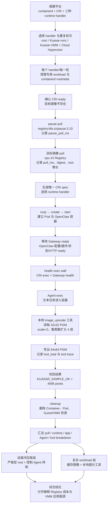

# OpenClaw / Kuasar Runtime Breakdown（最终整理版）

测试日期：2026-07-21  
平台：containerd + CRI v1 + Kuasar + Cloud Hypervisor
镜像：`localhost/openclaw-kuasar:2026.6.11-virtiofs`
远端 Registry：cpu-15 的 `10.2.30.50:5000`
模型：`deepseek/deepseek-v4-flash`

本报告只保留当前实验中最完整、可复核的结果批次。早期失败尝试、配置未归一的探索性批次，以及没有启用 Agent 样例的旧基线不作为主结果；它们只在“口径说明”中解释原因。

## 1. 实验摘要

本实验在同一个隔离 containerd CRI 上比较三条 OpenClaw 路径：

1. 普通 `runc`；
2. Kuasar runc-sandboxer（handler：`kuasar-runc`）；
3. Kuasar VMM sandboxer + Cloud Hypervisor（handler：`kuasar-vmm`）。

实验同时回答四个问题：

- 三种 runtime 是否都能可靠启动 OpenClaw Gateway 并完成 Agent 请求；
- 缓存镜像时，runtime API、OpenClaw Gateway、health 和 Agent 各自耗时多少；
- 镜像位于cpu-15 时，pause 镜像和目标 OpenClaw 镜像的拉取成本是多少；
- Agent 调用容器内本地图片工具时，真正的图片处理时间是否是 VMM 慢的原因。

最终结果如下：

- 缓存镜像基线、远端冷拉取和复杂本地工具 workload 均为三种 handler 各 3/3
  通过；
- Kuasar runc 与普通 runc 的 OpenClaw 应用级时间接近；
- Kuasar VMM 的主要额外时间不在 `create/start`，而在 Guest 内 OpenClaw
  bootstrap、Gateway 初始化、health CLI 和 virtiofs 文件访问；
- 远端目标镜像 pull 约 8.0 秒，pause pull 约 6.1--6.4 秒，三种 handler
  之间差异很小；
- 本地 `image_upscale` 工具本身仅约 87--91 ms，不能解释 VMM 的几十秒级差异。

本报告把“远端镜像 pull”和“缓存镜像后的图片超分”分别测量。流程图展示完整的目标链路，但当前 artifact 尚未在同一批次中同时执行“清空 root、远端 pull、内部超分”，因此两组 `total` 不能直接相加。

## 2. 实验对象与平台配置

### 2.1 三种 runtime handler

| handler | containerd runtime type | 实际 sandbox 路径 | 本实验中的隔离/存储特点 |
| --- | --- | --- | --- |
| `runc` | `io.containerd.runc.v2` | containerd → runc | 宿主机 namespace；`/app` 为 overlay，OpenClaw state 为 ext4 |
| `kuasar-runc` | `io.containerd.kuasar-runc.v1` | containerd → `runc-sandboxer` → runc | Kuasar runc sandbox；本实验使用 host network，`/app` 为 overlay，state 为 ext4 |
| `kuasar-vmm` | `io.containerd.kuasar-vmm.v1` | containerd → `vmm-sandboxer` → Cloud Hypervisor → Guest task service | VM 级隔离；`/app` 与 state 经 virtiofs，Guest 内使用独立状态目录和 CNI 网络 |

这里的 `vmm-sandboxer` 不是系统默认 daemon，而是 Kuasar 提供并由本平台安装的 sandboxer 进程；Cloud Hypervisor 是它启动和管理的 VMM。三种路径都由同一个 containerd CRI endpoint 接收请求，区别集中在 runtime handler 及其 Guest/存储路径。

### 2.2 共同应用与外部依赖

- OpenClaw 版本：`2026.6.11`；
- 目标镜像：派生的 `localhost/openclaw-kuasar:2026.6.11-virtiofs`；
- 控制 Agent 样例：文本指令要求精确返回 `KUASAR_SAMPLE_OK`；
- 复杂 workload：文本 Agent 指令调用容器内本地 `image_upscale` 工具，不上传
  图片给 DeepSeek；
- provider/model：`deepseek/deepseek-v4-flash`，样例结果要求
  `fallbackUsed=false`；
- 远端 Registry：cpu-15 的 HTTP Registry，目标镜像 digest 在 9 个远端冷拉取
  轮次中一致；
- 网络、Registry 吞吐和模型服务端响应属于外部变量，不能直接解释为 runtime
  固有开销。

### 2.3 状态与公平性边界

三种路径并非只改变一个组件：VMM 同时引入 Guest、Cloud Hypervisor、virtiofs、CNI 和不同的状态/journal 配置。因此结论描述的是当前整套配置，而不是 Cloud Hypervisor 单独的因果贡献。

| 项目 | `runc` / `kuasar-runc` | `kuasar-vmm` |
| --- | --- | --- |
| `/app` | overlay | virtiofs |
| OpenClaw state | ext4 | virtiofs，独立 Guest 状态目录 |
| SQLite journal | WAL | DELETE（当前 VMM 配置） |
| 网络 | host network | CNI bridge，Guest 内 eth0 |
| 用户 | 容器用户 1002:1002 | Guest 入口按当前 spec 运行，状态目录需具备写权限 |

## 3. 计时口径与统一阶段定义

### 3.1 时间来源

除 `health_internal` 和 `agent_internal` 外，指标均为宿主机观察到的 wall-clock 时间，包含 CRI RPC、进程调度、日志轮询、Guest transport 和 I/O 等等待。

- `health_internal`：health JSON 的 `durationMs`；
- `agent_internal`：Agent sample JSON 的 `meta.durationMs`；
- 两者都不是宿主机调用者的完整等待时间；实际调用者等待分别看
  `health_exec_wall` 和 `agent_sample_exec_wall`。

### 3.2 阶段定义

| 阶段 | 起点 → 终点 | 实际行为 |
| --- | --- | --- |
| reset | 开始清理专用 root/state → 空目录和新 containerd 可用 | 停止隔离 workload，备份/移动专用 containerd root 与 state，重新启动服务 |
| CRI ready | `crictl info` 发出 → CRI info 返回 | 确认专用 containerd Unix socket 和 CRI RuntimeService 可用 |
| pause pull | pause pull 发出 → pause 镜像服务返回 | 解析、下载、解压 `registry.k8s.io/pause:3.10` |
| 目标 pull | 目标 `crictl pull` 发出 → 目标 digest 导入完成 | 从服务器 B Registry（`10.2.30.50:5000`）解析 manifest、下载 blobs、解压并写入 containerd root |
| runp | `RunPodSandbox` 发出 → sandbox ID 返回 | 创建 Pod sandbox、网络和 runtime sandbox；VMM 还建立 Guest/Cloud Hypervisor 资源 |
| create | `CreateContainer` 发出 → container ID 返回 | 解析镜像/snapshot、生成容器配置、登记挂载和元数据；此时应用尚未运行 |
| start | `StartContainer` 发出 → CRI 返回 | 启动容器 init；返回不代表 OpenClaw ready |
| Gateway ready | Start 返回 → 日志首次出现 `[gateway] ready` | OpenClaw 加载配置、认证、插件、SQLite/state，启动 HTTP/WebSocket、channels 和 sidecars |
| exec true / Node | CRI exec 发出 → `true` 或 Node 输出返回 | 分别测通用 exec 通道和最小 Node 启动 |
| health exec wall | 完整 health exec 发出 → JSON 返回 | 新起 Node/OpenClaw CLI，加载配置/插件/state，连接本地 Gateway 并请求 health |
| health internal | health JSON 的 `durationMs` | health CLI/Gateway 内部记录的时间；边界窄于完整 exec wall |
| Agent sample exec wall | Agent exec 发出 → Agent JSON 返回 | 新起 OpenClaw CLI，加载 session/auth，调用 DeepSeek；复杂 workload 还包含工具选择、工具执行和结果写回 |
| agent internal | Agent JSON 的 `meta.durationMs` | OpenClaw embedded Agent runtime 内部时间，包含 provider 请求和工具调用 |
| tool total | `image_upscale` 工具开始 → 输出 trace 完成 | 工具读取输入、计算、写出 64x64 PGM |
| cleanup | stop/rm container → stopp/rmp sandbox 完成 | 删除容器、Pod；VMM 还回收 Guest/Cloud Hypervisor/virtiofs 资源 |
| total | 本轮首个 CRI 操作 → cleanup/结果落盘 | 汇总整轮宿主机端到端时间，包含 reset/pause pull/目标 pull（如该组启用） |

计时边界说明：`pull_ms` 仅覆盖目标 OpenClaw 镜像从 Registry 拉取到导入
containerd root 的时间；`pause pull` 单独记录为 `pause_pull_ms`，不并入目标
`pull_ms`，但会计入包含它的整轮 `total`。其余阶段不属于镜像拉取时间；它们各自
使用对应的 runtime、Gateway、health、Agent 或工具指标记录。`total` 是整轮端到端
wall time，不应当被解释为单一 runtime API 延迟。

### 3.3 三种实验流程的区别

**缓存镜像基线**：

```text
CRI ready → runp → create → start → Gateway ready
          → exec true/Node → health → Agent control sample → cleanup
```

**远端冷拉取**：

```text
reset → CRI ready → pause pull → 目标 OpenClaw pull
      → runp → create → start → Gateway ready → health
      → Agent control sample → cleanup
```

**复杂本地工具 workload**：

```text
缓存镜像 → runp/create/start → Gateway ready → health
         → Agent 文本指令 → image_upscale → 输出校验 → cleanup
```

`Gateway ready` 在本节先定义，后续结果只引用已定义的指标，不把容器 init 就绪误称为 OpenClaw 可用。

## 4. 实验矩阵与主结果选择

| 实验组 | 主 artifact | 每种 handler | 镜像条件 | Agent/工具 | 目的 |
| --- | --- | ---: | --- | --- | --- |
| 通用 runtime 冷启动 | `.artifacts/container-coldstart-20260720T025853Z` | 3 轮 | 缓存；`pull_ms=0` | 无 OpenClaw Gateway | 隔离 runp/create/start/容器 init |
| 缓存 OpenClaw 基线 | `.artifacts/breakdown-20260720T080115Z` | 3 轮 | 缓存 | 控制 Agent 样例 | 比较完整应用启动和 Agent 请求 |
| 远端 Registry 冷拉取 | `.artifacts/remote-coldstart-20260721T040235Z` | 3 轮 | 每轮空 root 后 pull | 控制 Agent 样例 | 测量 pause/目标 pull 和端到端部署路径 |
| 复杂本地工具 | `.artifacts/image-workload-20260721T071440Z` | 3 轮 | 缓存 | `image_upscale` | 测量 Agent 工具调用及图片副作用 |
| Gateway/health 细分 | `.artifacts/stage-profile-20260717T063949Z` | 每种 1 轮 | 缓存 | health | 拆分应用日志阶段和 Guest/host wall |
| Guest 文件/CLI 微基准 | `.artifacts/guest-profile-20260717T070701Z` | 每容器微基准 3 次 | 缓存 | CLI probes | 区分 `/app`、state、plugin 和 CLI 开销 |
| syscall 追踪 | `.artifacts/syscall-profile-20260717T074444Z`、`075157Z` | VMM 热/冷各 1 次 | profiling 镜像 | `config validate` | 定位 metadata、compile-cache、SQLite 检查 |

所有主结果批次都要求：容器生命周期成功、Gateway ready、health `ok=true`；控制样例要求精确返回 `KUASAR_SAMPLE_OK`；复杂 workload 还要求工具 trace 正确、输入 1,024 pixels、输出 4,096 pixels。

### 4.1 Agent 样例口径的历史说明

早期基础脚本的 `MODEL_SAMPLE_RUNS` 默认值为 `0`，因此旧 artifact 中 `sample_exec`/`sample_internal` 为 0，表示该阶段未执行，不是 0 ms。最终基线已在 `.artifacts/breakdown-20260720T080115Z` 中改为每种 handler 三轮执行控制样例；远端冷拉取和复杂  workload 脚本也都启用了 Agent 阶段。旧的未启用样例批次不参与本报告的 Agent 延迟比较。

## 5. 通用容器 runtime 冷启动（缓存镜像）

该组入口不是 OpenClaw Gateway，而是启动 shell 标记后保持存活的通用容器：`printf "CURSOR_CONTAINER_READY\\n"; exec sleep 300`。因此它只测 runtime 和容器 init，不把 Node/OpenClaw 初始化混入。

artifact：`.artifacts/container-coldstart-20260720T025853Z`，9/9 PASS，`pull_ms=0`。

| 阶段（3 轮平均） | runc | kuasar-runc | kuasar-vmm |
| --- | ---: | ---: | ---: |
| runp | 73 ms | 23 ms | 297 ms |
| create | 27 ms | 26 ms | 35 ms |
| start API | 69 ms | 62 ms | 71 ms |
| 容器就绪标记 | 24 ms | 23 ms | 25 ms |
| cleanup | 137 ms | 205 ms | 320 ms |
| **runtime 冷启动总时间** | **330 ms** | **340 ms** | **747 ms** |

结论：Kuasar runc 与普通 runc 的通用 runtime 总时间接近；VMM 约为 runc 的 2.3 倍，主要增量在 sandbox `runp` 和回收，而不是 `start` 或容器 init。这个结果不能替代 Gateway ready：应用启动会额外引入 Node/OpenClaw、插件和状态目录访问。

## 6. 缓存镜像 OpenClaw 基线

artifact：`.artifacts/breakdown-20260720T080115Z`。三种 handler 均 3/3 PASS，每轮都完成 Gateway ready、health 和控制 Agent 样例。下表使用该批次的 3 轮 PASS 均值；这是缓存镜像对照的唯一主结果，不混用早期重复批次。

| 阶段（3 轮平均） | runc | kuasar-runc | kuasar-vmm |
| --- | ---: | ---: | ---: |
| runp | 69 ms | 23 ms | 304 ms |
| create | 27 ms | 26 ms | 37 ms |
| start | 65 ms | 67 ms | 71 ms |
| Gateway ready | 4,213 ms | 4,201 ms | 40,102 ms |
| exec true | 54 ms | 60 ms | 74 ms |
| exec Node | 85 ms | 86 ms | 125 ms |
| health exec wall | 3,396 ms | 3,421 ms | 32,900 ms |
| health internal | 8 ms | 8 ms | 571 ms |
| agent sample exec wall | 6,073 ms | 6,435 ms | 47,936 ms |
| agent internal | 2,270 ms | 2,642 ms | 9,244 ms |
| cleanup | 198 ms | 268 ms | 438 ms |
| **整轮 total** | **14,249 ms** | **14,659 ms** | **122,057 ms** |

控制样例 9/9 精确返回 `KUASAR_SAMPLE_OK`，provider/model 均符合预期，`fallbackUsed=false`。普通 runc 与 Kuasar runc 的 Gateway、health、Agent 和整轮时间接近；VMM 的 `runp` 仅增加约 0.2--0.3 秒，但 Gateway、health 和 Agent 均出现数量级增量。由此可见，VMM 的主要问题不在 containerd API 的创建/启动，而在容器启动后 Guest 内的 OpenClaw 应用生命周期。

## 7. 远端 Registry 镜像拉取冷启动

### 7.1 实验方法

每个 handler 的每一轮都执行以下操作：

1. 停止并清理旧 workload；
2. 备份并清空专用 containerd root/state；
3. 重启隔离 containerd 并确认 CRI ready；
4. 在计时窗口中先拉取 `registry.k8s.io/pause:3.10`；
5. 确认目标镜像在空 root 中不存在，再从cpu-15 Registry 拉取目标镜像；
6. 记录 digest、root 字节数变化和 pull wall time；
7. 执行与缓存基线相同的 runtime/Gateway/health/Agent/cleanup 流程。

artifact：`.artifacts/remote-coldstart-20260721T040235Z`。9/9 PASS；每轮 `cache_before=empty-root`、`cache_after=present`，目标 digest 均为 `sha256:c3a96adae29b5cc33acf1a5440fe460c26cf9e46f9a20d1a11fe58d992f5340a`。
专用 root 从约 1.25 MB 增长到约 1.37 GB，证明发生了实际镜像导入而不是命中旧缓存。

### 7.2 分阶段结果

| 阶段（3 轮平均） | runc | kuasar-runc | kuasar-vmm |
| --- | ---: | ---: | ---: |
| 专用 root reset | 175 ms | 192 ms | 192 ms |
| CRI ready | 142 ms | 149 ms | 141 ms |
| pause pull（公共成本） | 6,147 ms | 6,152 ms | 6,386 ms |
| 目标 OpenClaw pull | 8,050 ms | 8,020 ms | 8,046 ms |
| runp | 77 ms | 26 ms | 323 ms |
| create | 28 ms | 28 ms | 39 ms |
| start | 71 ms | 71 ms | 72 ms |
| Gateway ready | 4,210 ms | 4,206 ms | 40,151 ms |
| health exec wall | 3,396 ms | 3,333 ms | 31,673 ms |
| health internal | 8 ms | 8 ms | 495 ms |
| agent sample exec wall | 5,885 ms | 5,911 ms | 47,357 ms |
| agent internal | 2,140 ms | 2,149 ms | 9,316 ms |
| cleanup | 868 ms | 731 ms | 442 ms |
| **整轮 total** | **29,375 ms** | **29,147 ms** | **135,153 ms** |

### 7.3 新增阶段的具体解释

| 环节 | 计时内容 | 解释和边界 |
| --- | --- | --- |
| `pause_pull_ms` | 空 root 中通过 CRI 拉取 pause 镜像的完整 wall time | `RunPodSandbox` 依赖 pause 基础镜像；它不属于目标 OpenClaw `pull_ms`，但会计入整轮 `total`。单独记录可以隔离公共网络/解压成本 |
| 目标 `pull_ms` | 目标镜像从cpu-15 Registry 解析 manifest、下载 blobs、解压并导入专用 containerd root 的 wall time | 不包含 pause pull、runp/create/start、Gateway 或 Agent；9 轮空 root、digest 一致且 root 增长，证明不是 cache hit |
| `agent_sample_exec_wall` | 宿主机发起 `crictl exec` 到 Agent JSON 返回 | 包括 CRI exec、Node/OpenClaw CLI 启动、session/auth、模型请求、结果序列化和退出；远端组使用文本控制样例，不是图片超分时间 |
| `agent_internal` | Agent JSON 中 `meta.durationMs` | 只表示 OpenClaw embedded Agent runtime 的内部时间，包含 provider/Agent 处理；不包含 exec、CLI 启动、外层 state 访问和退出。它与 exec wall 的差值只是派生近似值 |

### 7.4 远端冷拉取结论

目标镜像 pull 在三种 handler 上都约 8.0 秒，pause pull 约 6.1--6.4 秒，差异只有几十毫秒；这两项主要由 Registry、内网传输和镜像解压决定，不能据此判断 runtime handler 优劣。VMM 的端到端差异仍来自 Gateway/health/Agent 的 Guest 应用路径，而不是目标镜像 pull。

由于每轮都包含约 14--15 秒的公共镜像/基础设施成本，VMM 整轮 total 相对 runc 的倍率被明显稀释；解释 VMM 性能时应优先看 `Gateway ready`、`health exec wall` 和 `agent sample exec wall`，再单独报告 `pull_ms`。

## 8. 复杂本地工具 workload：确定性图片超分

### 8.1 设计原因

DeepSeek 当前实验配置不承担多模态图片输入，因此没有把图片发送给模型。Agent 只接收文本任务，然后调用容器内本地 `image_upscale` 工具；图片读写和计算都在 workload 容器内完成。这让实验可以区分：

- 模型/Agent 决策时间；
- 本地工具实际计算时间；
- runtime/virtiofs 对工具文件访问的影响。

输入为确定性 32x32 PGM（1,024 pixels，1,037 bytes），工具按每个维度 `scale=2` 放大为 64x64（4,096 pixels，4,109 bytes），并执行 `passes=512` 次确定性平滑。每轮要求工具 trace `ok=true`、scale=2、像素数正确，Agent 最终 文本仍精确为 `KUASAR_SAMPLE_OK`。

### 8.2 结果

artifact：`.artifacts/image-workload-20260721T071440Z`。9/9 PASS，每种 handler 3/3 生成有效输出和工具 trace。

| 阶段（3 轮平均） | runc | kuasar-runc | kuasar-vmm |
| --- | ---: | ---: | ---: |
| runp | 76 ms | 24 ms | 317 ms |
| create | 27 ms | 26 ms | 34 ms |
| start | 70 ms | 68 ms | 73 ms |
| Gateway ready | 4,213 ms | 4,201 ms | 38,015 ms |
| health exec wall | 3,400 ms | 3,401 ms | 31,694 ms |
| health internal | 9 ms | 8 ms | 583 ms |
| Agent sample exec wall | 8,123 ms | 8,068 ms | 54,537 ms |
| Agent internal | 4,231 ms | 4,272 ms | 14,442 ms |
| tool read | 0.206 ms | 0.201 ms | 0.854 ms |
| tool compute | 87.151 ms | 86.357 ms | 88.576 ms |
| tool write | 0.186 ms | 0.166 ms | 1.959 ms |
| **tool total** | **87.543 ms** | **86.723 ms** | **91.388 ms** |
| cleanup | 207 ms | 279 ms | 440 ms |
| **整轮 total** | **16,327 ms** | **16,291 ms** | **125,394 ms** |

图片工具本身三条路径均约 87--91 ms；VMM 只有约 1.04 倍于 runc。VMM 的 Gateway、health 和 Agent 仍分别约为 38.0、31.7 和 54.5 秒，说明复杂 workload 没有改变瓶颈位置。相比控制样例，复杂 workload 的 Agent internal 增加，是模型决定工具、工具结果回传和 session 收尾的综合成本，不能等同于图片算法的 CPU 时间。

## 9. 诊断实验：Gateway、Guest 文件与 syscall

主结果回答“哪里慢”，诊断实验用于回答“为什么慢”。诊断实验样本较少，且 syscall trace 会放大 virtiofs 往返，因此只用于定位候选瓶颈，不替代三轮主结果。

### 9.1 Gateway ready 和 health 细分

artifact：`.artifacts/stage-profile-20260717T063949Z`，每种 handler 一轮。
这是诊断值，不与三轮主结果混合平均。

| Gateway 子阶段 | runc | kuasar-runc | kuasar-vmm |
| --- | ---: | ---: | ---: |
| 状态 readiness | 2 ms | 2 ms | 33 ms |
| readiness 后到 exec | 1 ms | 1 ms | 6 ms |
| exec 到 `loading configuration` | 3,190 ms | 3,130 ms | 33,483 ms |
| configuration loading | 34 ms | 34 ms | 1,253 ms |
| authentication resolving | 13 ms | 12 ms | 28 ms |
| Gateway core | 235 ms | 227 ms | 3,629 ms |
| HTTP server/listening | 95 ms | 95 ms | 1,248 ms |
| pre-channels | 49 ms | 49 ms | 2,950 ms |
| channels ready | 18 ms | 18 ms | 55 ms |
| actual ready | 3,637 ms | 3,568 ms | 42,685 ms |
| 日志观察到 ready | 4,123 ms | 4,117 ms | 43,129 ms |
| observation residual | 486 ms | 549 ms | 444 ms |

大约 77.6% 的 Gateway ready 差值发生在第一条 configuration 日志之前；其余约 22.3% 出现在配置、Gateway、HTTP、channels 和 sidecars 初始化阶段。日志轮询本身每次约 21--24 ms，不能解释 30--40 秒差异。

同一诊断批次的 health 结果：

| health 指标 | runc | kuasar-runc | kuasar-vmm |
| --- | ---: | ---: | ---: |
| host wall | 3,411 ms | 3,421 ms | 33,314 ms |
| guest command wall | 3,356 ms | 3,352 ms | 33,250 ms |
| host/guest residual | 55 ms | 69 ms | 64 ms |
| JSON `durationMs` | 8 ms | 7 ms | 609 ms |
| WS handler observation | 0 ms | 0 ms | 115 ms |
| CLI outer portion | 3,348 ms | 3,345 ms | 32,641 ms |

health 的主要差异位于新建 health CLI 的 guest 生命周期；CRI/vsock residual 和真正的 Gateway health handler 只占很小部分。

### 9.2 Guest 挂载、文件微基准与 CLI 黑盒

重复 guest profile artifact：`.artifacts/guest-profile-20260717T070701Z`。三种路径的 `/app` 都扫描 5,000 files/583 dirs；runc/Kuasar runc 使用 overlay，VMM 使用 virtiofs。

| Probe（重复微基准平均） | runc | kuasar-runc | kuasar-vmm |
| --- | ---: | ---: | ---: |
| `/app` metadata | 33.819 ms | 35.078 ms | 2,578.026 ms |
| `/app` 读取约 17.1 MB | 19.916 ms | 20.218 ms | 909.569 ms |
| state metadata | 0.859 ms | 0.893 ms | 93.264 ms |
| state 文件读取 | 2.014 ms | 2.031 ms | 66.634 ms |
| plugin metadata | 0.193 ms | 0.194 ms | 39.904 ms |
| plugin 文件读取 | 0.129 ms | 0.199 ms | 29.472 ms |
| JSON.parse 配置 50 次 | 1.422 ms | 1.354 ms | 24.338 ms |
| 微基准 total | 62.491 ms | 62.313 ms | 3,755.279 ms |

同一 profile 中的 CLI guest wall 平均：

| CLI 子命令 | runc | kuasar-runc | kuasar-vmm |
| --- | ---: | ---: | ---: |
| `--version` | 34.7 ms | 33.3 ms | 78.0 ms |
| `config validate` | 1,326 ms | 1,334 ms | 10,763 ms |
| `plugins list` | 3,199 ms | 3,207 ms | 27,229 ms |
| `models status` | 1,446 ms | 1,433 ms | 13,217 ms |

`--version` 仍然较快，说明最小 launcher/Node 启动不是主因；一旦命令需要加载配置、插件、模块树和状态，VMM 立即出现 8--11 倍级放大。

SQLite 只读 probe 也不能单独解释 30 秒级延迟：

| 数据库 probe | runc | kuasar-runc | kuasar-vmm |
| --- | ---: | ---: | ---: |
| `state/openclaw.sqlite` | 1.299 ms（WAL） | 1.399 ms（WAL） | 6.646 ms（DELETE） |
| `agents/main/agent/openclaw-agent.sqlite` | 0.333 ms（WAL） | 0.329 ms（WAL） | 5.558 ms（DELETE） |

### 9.3 Node I/O trace 与 guest syscall trace

Node 原生 fs trace 只覆盖显式 Node fs API，记录到的事件量很小，VMM 的累计显式 fs 时间约 20 ms，不能解释完整 CLI 的 10--30 秒 wall time。因此需要 guest 内 `strace` 查看模块加载器、动态链接器和 native addon 的实际系统调用。

`config validate` 的 syscall trace artifact：`.artifacts/syscall-profile-20260717T074444Z`。

| 指标（含 strace） | runc | kuasar-runc | kuasar-vmm |
| --- | ---: | ---: | ---: |
| guest wall | 2.519 s | 2.567 s | 58.031 s |
| 已解析 syscall | 30,652 | 30,644 | 39,126 |
| syscall 累计时间 | 347 ms | 359 ms | 11,516 ms |
| `/app` 调用数 | 20,889 | 20,889 | 20,885 |
| `/app` 累计时间 | 245 ms | 252 ms | 7,124 ms |
| `statx` 调用数 | 19,711 | 19,711 | 19,729 |
| `statx` 累计时间 | 218 ms | 226 ms | 5,516 ms |
| state 调用累计时间 | 0.8 ms | 0.9 ms | 484 ms |

三条路径的 `/app` 和 `statx` 调用次数几乎相同，但 VMM 的每次 metadata 往返显著更慢。strace 会非均匀放大 virtiofs，因此倍率不能直接外推为无追踪性能；它与无 trace 文件微基准方向一致，支持 `/app` 模块/插件 metadata 是首要候选瓶颈。

同一 VMM 容器内的两次 trace（`.artifacts/syscall-profile-20260717T075157Z`）：

| 指标 | 第 1 次 | 第 2 次（复用 compile cache） | 变化 |
| --- | ---: | ---: | ---: |
| guest wall（含 strace） | 56.181 s | 53.847 s | -4.2% |
| syscall 累计时间 | 11.271 s | 8.707 s | -22.8% |
| `/app` 累计时间 | 6.935 s | 6.531 s | -5.8% |
| other（主要含 compile cache） | 3.198 s | 0.887 s | -72.3% |
| state 累计时间 | 487 ms | 471 ms | -3.4% |
| compile-cache rename | 1,534 | 0 | 消失 |
| `statx` 调用数 | 19,727 | 19,728 | 基本不变 |

这说明 Node compile-cache 重建是一次性次级冷启动因素；warm 后 `/app` metadata 高延迟和 state 的重复检查仍然存在。VMM trace 还观察到约 767 次 `openclaw.sqlite-journal` 和约 761 次 `openclaw.sqlite-wal` 存在性检查，直接累计时间小于 `/app` 扫描，暂不能把它们排序为主因。

## 10. 瓶颈归因

证据链按强弱排序如下：

1. **不是 containerd/CRI API**：VMM `runp` 约 0.3 秒，`create/start` 约几十毫秒；
   通用容器 cold start 也只有约 0.75 秒。
2. **不是通用 exec/vsock transport**：VMM `exec true` 约 70 ms、最小 Node exec
   约 125 ms，host/guest residual 约几十毫秒。
3. **不是 Gateway health handler**：VMM health JSON `durationMs` 约 0.5--0.6 秒，
   WS handler 约百毫秒；health exec wall 的约 32 秒主要在新 CLI 初始化前后。
4. **首要候选是 virtiofs 上的 `/app` metadata**：同等规模的 `statx`/目录访问在
   VMM 上数量相近但单次代价显著更高；无 trace 微基准和 strace 方向一致。
5. **次级因素是 compile-cache 和 state/journal 检查**：compile-cache 在第二次
   trace 中消失，说明它属于一次性冷启动；SQLite journal/WAL 检查仍需单独 A/B。
6. **不是图片算法本身**：`image_upscale` 约 87--91 ms，而 VMM 的 Gateway、health
   和 Agent 仍为几十秒级。

因此当前最可信的结论是：VMM 的性能瓶颈集中在 Guest 内 OpenClaw 启动/CLI bootstrap 访问大量模块和插件小文件时的 virtiofs metadata 路径；不能把整个差异归因于 Cloud Hypervisor，也不能把 Agent provider 的网络等待归因于 runtime。

## 11. 结论与边界

### 11.1 已完成的部署与实验结论

- containerd + Kuasar + Cloud Hypervisor + OpenClaw 平台已跑通；
- 三种 handler 的缓存基线、远端 Registry 冷拉取和复杂本地工具 workload 均
  3/3 通过；
- Kuasar runc 与普通 runc 在当前配置下应用级时间接近；
- Kuasar VMM 提供 VM 级隔离，但当前 virtiofs/Guest 路径使 Gateway、health 和
  Agent 端到端时间约为 runc 的 8--10 倍；
- 远端目标镜像 pull 约 8.0 秒，pause pull 约 6.1--6.4 秒，三种 handler 差异
  很小；
- 本地图片工具成功把 1,024 pixels 放大到 4,096 pixels，工具自身约 87--91 ms；
- 目前证据支持 `/app` metadata 访问为首要优化对象，compile-cache 和 SQLite
  状态检查为待验证的次级因素。

### 11.2 限制

- VMM 同时改变 Guest、Cloud Hypervisor、virtiofs、CNI、journal 和状态目录，不能
  将结果解释为 Cloud Hypervisor 单独贡献；
- Registry pull 受cpu-15、内网和解压速度影响；Agent sample 受公网模型服务
  调度影响；
- 三种 handler 的执行顺序固定，仍可能存在系统性顺序效应；
- guest 微基准共享部分 host cache，syscall trace 会放大绝对耗时；
- 远端冷拉取与图片超分目前分属两个 artifact，不能拼接均值得到组合总时延；
- 本实验没有评估安全隔离强度，只验证 runtime 路径和应用功能。

### 11.3 后续计划

- [x] 三种 handler 的缓存镜像基线三轮对照；
- [x] cpu-15 Registry 的每轮空 root 目标镜像冷拉取；
- [x] Gateway ready、health exec wall 的阶段细分；
- [x] Guest 文件、CLI、Node I/O 和 syscall 诊断；
- [x] 文本 Agent 调用本地工具完成 32x32 → 64x64 图片超分；
- [ ] 对 `/app` rootfs 做 overlay/ext4/virtiofs 等存储后端 A/B；
- [ ] 持久化 Node compile cache，单独测量其对首次 CLI 的影响；
- [ ] 对 SQLite WAL/DELETE、state 目录和 journal 路径做隔离 A/B；
- [ ] 编写合并脚本，在同一轮中执行“空 root → 远端 pull → OpenClaw → 内部超分”，
  记录组合总时延而不拼接两个独立实验的均值；
- [ ] 通过随机化 handler 顺序或扩大批次，进一步降低模型服务端顺序效应。

## 12. 最终实验流程图



图中主链是最终希望复用的“远端 pull 后执行内部超分任务”路径；当前两个主 artifact 分别覆盖远端 pull/控制样例和缓存镜像/内部超分。后续合并脚本完成后，才能把这条主链作为单一端到端样本报告组合总时延。
