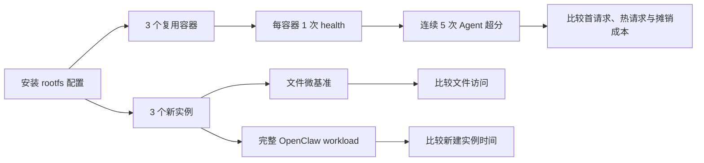

# Kuasar VMM Rootfs 与容器复用控制变量实验

日期：2026-07-27——2026-07-28

## 1. 实验目的

OpenClaw 启动和 CLI 执行会扫描大量 JavaScript 模块、插件、配置及状态文件。此前实验发现，Kuasar VMM 使用 VirtioFS `cache=never` 时，这类小文件 metadata 操作会累积为数十秒延迟。

本实验回答两个问题：

1. 将 rootfs 从 VirtioFS `cache=never` 改为 `cache=metadata` 或 virtio-blk，
   能改善多少？
2. 同一个容器连续处理多个请求时，一次性启动成本能摊薄多少？

最终结果：三种 rootfs 的新建实例实验均为 3/3 PASS；三种 rootfs 的复用实验均为 15/15 PASS。

## 2. 实验设计

### 2.1 固定条件与控制变量

| 项目 | 固定值 |
| --- | --- |
| 上层接口 | containerd CRI |
| Sandbox runtime | Kuasar vmm-sandboxer |
| VMM | Cloud Hypervisor v52.0 |
| Guest | 2 vCPU、2048 MiB |
| OpenClaw | 2026.6.11 |
| 镜像 | `10.2.30.50:5000/openclaw-kuasar:2026.6.11-virtiofs` |
| workload | 32×32 PGM 超分至 64×64，`passes=512` |
| 模型职责 | DeepSeek 选择并调用本地 `image_upscale` 工具，图片不发送给模型 |

三组只改变容器文件系统提供方式：

| 配置 | container backend | cache | Guest 内文件系统 |
| --- | --- | --- | --- |
| virtiofs-never | virtiofs | never | FUSE/VirtioFS |
| virtiofs-metadata | virtiofs | metadata | FUSE/VirtioFS |
| virtio-blk | virtio-blk | 不适用 | ext4 |

virtio-blk 使用修补后的 Kuasar v1.1.0 vmm-sandboxer，向 Cloud Hypervisor v52.0 显式传递 raw image type。正式实验使用的二进制 SHA-256 为：

```text
85303a286ff3f676d56a6c784564688ca42bf181b630299c02bd435dff7bf33d
```

### 2.2 两类实验

**新建实例实验**：每种配置运行 3 个独立的新 Pod/VM/容器。镜像提前拉取，pull 不计入时间。每轮依次执行：

```text
runp → create → start → Gateway ready → health → Agent/超分 → cleanup
```

**容器复用实验**：每种配置创建 3 个新容器；每个容器等待 Gateway ready、执行一次 health，再连续执行 5 次相同超分请求，共 15 次请求。每次使用独立 session，避免上下文增长混入结果。



### 2.3 关键指标

| 指标 | 含义 |
| --- | --- |
| `start` | CRI StartContainer 调用时间 |
| Gateway ready | start 返回到日志出现 `[gateway] ready` |
| health exec | host 发起 health exec 到 CLI 退出 |
| Agent exec | host 发起 Agent exec 到 CLI 退出 |
| Agent internal | Agent JSON 中的 `meta.durationMs` |
| tool total | 本地超分工具读取、计算和写出总时间 |
| total | 新建实例单轮完整 wall time |

每次 Agent 请求仍会启动新的 `node openclaw.mjs agent --local` 进程。因此“容器复用”复用了 VM、容器、Gateway 和文件系统缓存，但没有复用 Node/Agent 进程。

## 3. 实验结果

### 3.1 功能与数据有效性

| 实验 | virtiofs-never | virtiofs-metadata | virtio-blk |
| --- | ---: | ---: | ---: |
| 新建实例 workload | 3/3 PASS | 3/3 PASS | 3/3 PASS |
| 容器复用请求 | 15/15 PASS | 15/15 PASS | 15/15 PASS |

所有有效请求均满足：Gateway health 为 `ok=true`、Agent 返回 `KUASAR_SAMPLE_OK`、工具调用成功、输出像素数由 1,024 增至 4,096。

### 3.2 文件系统微基准

三轮均值：

| 配置 | `/app` metadata | `/app` read | micro total |
| --- | ---: | ---: | ---: |
| virtiofs-never | 2,652.7 ms | 954.3 ms | 4,022.4 ms |
| virtiofs-metadata | 311.4 ms | 273.9 ms | 669.9 ms |
| virtio-blk | 75.4 ms | 111.3 ms | 220.4 ms |

相对 `cache=never`，metadata cache 将微基准缩短约 6.0 倍；virtio-blk 缩短约 18.2 倍。差距主要出现在 metadata 和小文件读取，而不是计算。

### 3.3 新建实例完整 workload

三轮均值，镜像 pull 不计入：

| 配置 | start | Gateway ready | health exec | Agent exec | total |
| --- | ---: | ---: | ---: | ---: | ---: |
| virtiofs-never | 0.068 s | 38.680 s | 31.802 s | 54.336 s | 126.039 s |
| virtiofs-metadata | 0.052 s | 7.694 s | 7.352 s | 11.159 s | 27.339 s |
| virtio-blk | 5.930 s | 5.604 s | 4.541 s | 9.496 s | 26.851 s |

相对 `cache=never`：

- `cache=metadata` 总时间降低 78.3%，加速约 4.61 倍；
- virtio-blk 总时间降低 78.7%，加速约 4.69 倍；
- metadata 与 virtio-blk 的总时间只相差约 0.49 s。

virtio-blk 的文件访问最快，但它把约 5.9 s 的镜像准备和块设备挂载成本放在 `start` 阶段。因此单个新建实例的最终总时间只略快于 metadata。

### 3.4 容器复用

每组 3 个容器、每容器 5 次请求：

| 配置 | startup | 首次 Agent | 第 2—5 次 Agent | 完整摊销/请求* |
| --- | ---: | ---: | ---: | ---: |
| virtiofs-never | 37.749 s | 54.444 s | 52.415 s | 66.963 s |
| virtiofs-metadata | 7.759 s | 11.014 s | 11.431 s | 14.609 s |
| virtio-blk | 11.793 s | 8.624 s | 8.372 s | 11.972 s |

\* 完整摊销包含每容器一次 startup、一次 health、5 次 Agent 请求和一次 cleanup，再除以 5。

同每请求新建实例相比：

| 配置 | 新建实例/请求 | 复用后/请求 | 降低 |
| --- | ---: | ---: | ---: |
| virtiofs-never | 126.039 s | 66.963 s | 46.9% |
| virtiofs-metadata | 27.339 s | 14.609 s | 46.6% |
| virtio-blk | 26.851 s | 11.972 s | 55.4% |

热 Agent 请求相对首次请求只变化约 -3.7% 至 +3.8%，没有稳定的大幅加速。复用的主要收益来自减少重复的 VM/容器启动、Gateway ready、health 和 cleanup。

### 3.5 virtio-blk 启动成本摊平点

按 `(startup + Agent 请求) / 请求数` 计算：

| 每容器请求数 | virtiofs-metadata | virtio-blk | 更优 |
| ---: | ---: | ---: | --- |
| 1 | 18.773 s/请求 | 20.417 s/请求 | metadata |
| 2 | 15.102 s/请求 | 14.394 s/请求 | virtio-blk |
| 3 | 13.878 s/请求 | 12.387 s/请求 | virtio-blk |
| 5 | 12.899 s/请求 | 10.781 s/请求 | virtio-blk |

按当前数据，virtio-blk 在同一容器执行第 2 个请求时即可摊平额外启动成本。

### 3.6 实际超分计算

三种配置的 `image_upscale` tool total 均约 88—92 ms。rootfs 的选择几乎不影响超分计算本身；数十秒差距来自 OpenClaw/Node CLI bootstrap、配置和插件扫描以及文件访问。

## 4. 原因分析

### 4.1 为什么 cache=never 慢

OpenClaw 启动会执行大量 `stat`、目录遍历和小文件读取。`cache=never` 下，这些 metadata 查询频繁跨越 Guest VFS、VirtioFS、virtiofsd 和 host filesystem。单次开销不大，但累积后形成数十秒延迟。

### 4.2 metadata cache 改善了什么

`cache=metadata` 允许 Guest 复用目录项和文件属性，显著减少跨 Guest/Host 的 metadata 往返。因此文件微基准、Gateway、health CLI 和 Agent CLI 同方向改善，而超分工具时间基本不变。

### 4.3 virtio-blk 改善了什么

virtio-blk 将容器文件放在 Guest 内挂载的 ext4 块设备上，文件遍历不再逐次经过 VirtioFS。它获得了最快的 metadata、Gateway 和 CLI 时间，代价是容器 start 阶段需要准备并挂载块设备。

### 4.4 复用为什么没有明显加速 Agent 本身

每次请求仍通过 CRI exec 启动一个新的 Node/OpenClaw CLI，并执行配置、插件和状态
初始化。复用只消除 VM、容器和 Gateway 的重复创建。若要继续降低单请求时间，下一步应复用长生命周期 Gateway/Agent 进程，而不是每次执行 `agent --local`。

## 5. 限制

1. 每种新建实例只有 3 轮；复用实验为 3 个容器、每容器 5 次请求。
2. DeepSeek 网络和服务延迟会影响 Agent 数据；本地文件微基准和 tool total 更稳定。
3. 实验顺序未随机化，也没有执行 host 级 `drop_caches`。
4. `cache=metadata` 改变 host/guest 元数据一致性语义；尚未测试并发外部修改。
5. 复用实验没有测并发、长期内存增长和进程级 Agent/Gateway RPC 复用。
6. 一次 virtio-blk 复用预跑因 DeepSeek `ECONNRESET` 失败，已排除；修复采集脚本后
   的正式结果为 15/15 PASS。

## 6. 结论

1. 原始瓶颈是 VirtioFS `cache=never` 上的大量小文件 metadata 访问，不是图片计算。
2. `cache=metadata` 以很小的 start 成本获得接近 virtio-blk 的单实例总时间，适合
   单请求或低复用次数场景，但需评估一致性语义。
3. virtio-blk 文件访问和持续请求性能最好；额外启动成本在第 2 个请求即可摊平。
4. 复用容器可将完整每请求成本降低约 47%—55%，但不会显著缩短单次 Agent CLI。
5. 下一步应测试长生命周期 Gateway/Agent RPC，进一步消除每请求 Node CLI bootstrap。

## 7. 原始数据与复现入口

| 内容 | 路径 |
| --- | --- |
| virtiofs-never 新建实例 | `.artifacts/rootfs-virtiofs-never-20260728T014459Z` |
| virtiofs-metadata 新建实例 | `.artifacts/rootfs-virtiofs-metadata-20260728T020330Z` |
| virtio-blk 新建实例 | `.artifacts/rootfs-virtio-blk-20260728T011336Z` |
| virtiofs-never 复用 | `.artifacts/reuse-virtiofs-never-20260728T025050Z` |
| virtiofs-metadata 复用 | `.artifacts/reuse-virtiofs-metadata-20260728T023552Z` |
| virtio-blk 复用 | `.artifacts/reuse-virtio-blk-fixed-20260728T032302Z` |
| virtio-blk patch | `patches/kuasar-v1.1.0-cloud-hypervisor-v52-image-type.patch` |
| 新建实例编排 | `scripts/19-benchmark-rootfs-config.sh` |
| 容器复用 | `scripts/18-benchmark-container-reuse.sh` |
